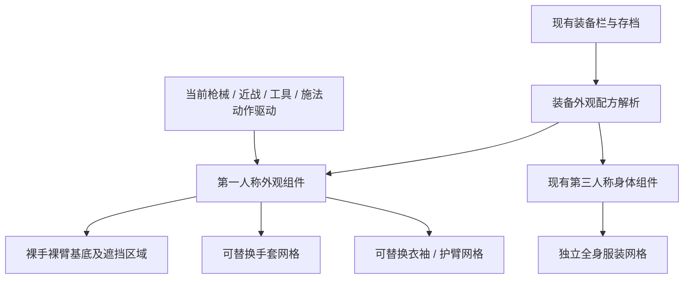

# 第一人称手部、手臂模块化换装规划 v1

2026-09-24，FPSGAME / UE 5.8.2。本文是针对当前工程制定的制作与接入方案；尚未制作模块网格、改写运行系统、导入装备或执行测试。

后续实施记录：本规划的第一套长袖、短手套及独立换装接入已完成并落盘，见 `modular-equipment-implementation-20260924.md`。以下保留最初规划内容；实际配置采用独立的 `modular_outfits.json` 表现配方，并沿用现有物品与存档系统。未运行游戏测试。

## 1. 目标与当前基础

目标：装备一副手套时真正更换手部模型；装备衣服时更换上臂、小臂衣袖模型。已有持枪、换弹、抓握、近战、工具和施法动作继续由原系统驱动。以后新增装备以制作资产及填写外观配方为主，不逐把枪重做整套动作。

当前已有：

- `ColdSteelInventoryRules.cpp` 有 `gloves` 与 `armor` 装备槽，装备实例、位置与存档沿用现有系统。
- `FPSPlayerBodyEquipment.cpp` 按装备 Definition 读取 `player_body.json.outfits`，支持第三人称 `world_mesh`、身体材质替换及第一人称 `first_person_materials`。
- 本轮读到的 `outfits` 仍为空。存在代码入口不代表已有可用的模块化手套/袖子库。
- `SourceAssets/HandEquipmentAppearance` 提供已接受的棕皮革手套、裸露前臂、炭灰袖子材质基线。此前的 3 cm 手套延长与薄卷边是材质覆盖效果，并非可换的独立几何。
- 当前枪械视模包含手臂几何；SVD 沿用 Manny 手臂源，PKM 使用独立 Skeleton。名称相同不能证明全部参考姿态、骨段、单位与蒙皮绑定相同。
- 当前 `ApplyOutfit` 会受世界身体开关和 BodyMesh 是否存在影响。新的第一人称换装必须独立工作，不能因关闭第三人称身体而失效。

## 2. 推荐结构：保留动作，分离可见外观



首期保留当前武器视模及其骨骼、动画和机械骨；将其中原手臂的渲染区隐藏，再由跟随同一姿态的外观网格显示手臂。不在换装时重绑枪械，也不复制一套独立换弹计时。

**只隐藏已登记的手臂渲染区域，不能隐藏手臂骨骼或缩放骨骼到零。** 骨骼仍负责新外观变形。旧视模上的手臂区若与枪体混在同一渲染 section，先在独立候选网格中拆分 section；保留顶点、绑定和原动作，不直接隐藏整块含枪体的材质。按每个 LOD 记录映射，不把槽索引写死为所有武器相同。

长期可再将纯动作驱动与枪体渲染彻底分离；这不是首期换装的前置要求。

## 3. 装备槽、覆盖区域与实际网格分开定义

| 玩家装备 | 外观覆盖区 | 建议网格组织 |
| --- | --- | --- |
| 手套 `gloves` | 左右手、手指、腕口，按款式延伸至前臂 | 一副手套一个资源；需要独立左右驱动时输出左右派生件 |
| 衣服 / 铠甲 `armor` | 上臂、肘部、小臂及衣袖开口 | 普通长袖保留跨肘连续网格；短袖、无袖按款式定义覆盖 |
| 衣服上的护臂、肩甲 | 指定上臂或小臂区域 | 可分件，但软质内袖在肘部保持连续 |
| 未覆盖身体 | 裸手、裸臂 | 恢复基础身体；脱掉手套时要显示真正的裸手几何 |

`UpperArm_L/R`、`Forearm_L/R`、`Hand_L/R` 是外观区域，不默认增加六个背包装备槽。一件衣服可以同时占多个外观区域。以后若要单独穿戴左右护腕，再扩展装备槽、UI 和存档合同。

不要为了模块化把肘关节正中硬切成两个自由拼接件。普通衣袖优先整段跨肘；确需分开的上臂甲、小臂甲，在软内袖之外组合。腕部与肘部设置专用衔接带，不把裸露断面留给镜头。

## 4. 动画跟随与绑定规格

首选 **Leader Pose** 跟随当前实际动作驱动，让相同的手指、腕、前臂和 twist 姿态直接驱动新网格。它要求匹配的骨骼结构，不能独立驱动附加骨或独立物理；多网格仍有各自渲染成本。需要独立附骨动画或布料时，再为指定装备采用 Copy Pose 及后续模拟，并明确先求值动作源的顺序。[Epic 模块化角色文档](https://dev.epicgames.com/documentation/en-us/unreal-engine/working-with-modular-characters-in-unreal-engine)

Leader Pose、Copy Pose 都不是任意骨架自动兼容器。为现有视模建立 `RigProfile`，登记骨名、父子链、局部参考变换、骨段长度、导入单位、根缩放、组件基准、左右手映射与手臂 section。是否共用一个 profile 由这些数据决定，不能按枪名或 Skeleton 资产名猜测。

每个新装备保留一份标准高质量作者源，离线为已支持的 RigProfile 输出绑定派生资源：

1. 手臂绑定一致的武器直接复用同一资源。
2. 仅机械骨不同、手臂链一致的武器可共用兼容的手臂子树；所有祖先链保留，不能删除中间关节。
3. 手臂 rest、比例或导入约定不同的 profile，由作者工具转出对应网格绑定；没有兼容派生资源的 profile 保留原外观，不盲目挂上产生拉伸。

不要运行时根据骨骼同名套局部旋转修差，也不要为换装改现有共享 Skeleton 的 reference pose。已有导入存在根缩放等约定，外部网格按物理尺寸制作，但导出必须遵循模板；不能擅自把骨架缩放统一成 1。

## 5. 新装备建模标准

| 项目 | v1 制作约定 |
| --- | --- |
| 作者模板 | 从已接受手臂建立独立模板，保留骨架、参考姿态、定位标记、骨长和接触参考面；记录 `RigProfile` / `BodyProfile` 版本 |
| 裸露基底 | 制作适合裸露的手与臂几何；当前手套改成肤色不能视为裸手已完成 |
| 抓握接触 | 掌内、指腹、虎口设参考接触面，新增厚度优先放在手背与外侧；明显厚重的掌甲需要单独适配，不能承诺自动兼容每个握把 |
| 蒙皮 | 从对应模板转移初始权重，再处理手指根、虎口、腕部、肘部和 twist 区；不改骨长，不靠缩骨隐藏身体 |
| 袖口 | 几何袖口有真实厚度、内壁及收边；仅需要颜色或浅缝线时才用材质细节 |
| 接缝 | 预定义衔接环/重叠带；暴露接缝两侧保持匹配位置、权重与法线，各 LOD 使用一致边界；重叠不得造成皮肤、内袖穿出 |
| 材质 | 稳定的 Skin / Fabric / Leather / Metal 区域；每个角色使用自己的材质覆盖或 MID，染色不能改全局共用材质 |
| LOD | 关节环、指尖与接触区优先保留；允许远处减面，不能换 LOD 时改变遮挡边界；按组件控制数量，常规裸臂 + 手套 + 衣袖优先三组网格 |
| 交付 | 可编辑 Blend、带权重 FBX、PBR 贴图、RigProfile 派生表、覆盖区、袖口兼容信息及来源许可 |

制作标准固定方法和接口。现有 3 cm 袖口长度属于原装备款式，不强制给所有新手套套用。

## 6. 遮挡与长袖 / 长手套组合

身体基底提供专用区域遮罩或分区；衣服和手套声明自己覆盖的区域，由装备组合求并集。粗略部位可按 section 隐藏；局部袖口采用作者遮罩。遮罩边界应藏在服装重叠区内，不暴露在屈肘、旋腕后的视线中。

袖口按配方显式选择：

- 短手套 + 长袖：袖子与手套接在预定腕口，可选择露一圈皮肤或袖口搭接。
- 长手套 + 长袖：款式定义 `GloveOverSleeve` 或 `SleeveOverGlove`；使用对应收口/内塞派生袖口与覆盖区，不能仅改变绘制顺序。
- 无袖 / 短袖：保留未覆盖皮肤；肘与前臂不因衣服占用 armor 槽就全部隐藏。
- 不支持的组合：使用明确的兼容款式或保留已有完整外观，不能先隐藏基底再发现替换网格缺失。

## 7. 数据与运行时接入

第一版扩展现有 `player_body.json.outfits.<物品Definition>`，使用一个共用的外观配方解析器；不在物品描述字段塞模型路径，不另建一套物品拥有权。已有 `world_mesh`、`body_materials`、`first_person_materials` 继续兼容，新字段统一归一化后交给第一、第三人称表现层。

下面仅是**拟定格式示例**，路径和字段均未接入运行时：

```json
{
  "example_long_gloves": {
    "appearance_version": 1,
    "first_person": {
      "body_profile": "fp_arms_standard_v1",
      "parts": [{
        "part_id": "gloves",
        "regions": ["Hand_L", "Hand_R", "Wrist_L", "Wrist_R"],
        "rig_meshes": {
          "EXAMPLE_rig_profile": "/Game/Characters/Equipment/Example/SK_FP_Gloves"
        },
        "coverage_profile": "example_long_gloves",
        "cuff_mode": "GloveOverSleeve"
      }]
    },
    "world_mesh": "/Game/Characters/Equipment/Example/SK_TP_Gloves"
  }
}
```

示例 profile 名称不代表现有资产已兼容。衣服使用同样格式，一项 parts 可同时覆盖上臂、肘、小臂；厚护甲可由多个 parts 组成。

| 代码职责（拟新增/扩展） | 输入与输出 | 所有权 |
| --- | --- | --- |
| `FPSEquipmentAppearanceCatalog` | 解析现有 outfits，生成只读配方、骨架派生与覆盖组合 | `FPSGAME/Characters`，共用数据，不持有玩家状态 |
| `UFPSFirstPersonAppearanceComponent` | 从装备和当前姿态源解析第一人称外观，管理网格、遮罩、独立材质 | 每个角色一个组件；销毁时释放异步句柄与网格 |
| `FPSPlayerBodyComponent` | 消费同一装备外观状态，继续负责第三人称全身服装及可见性 | 保留当前职责；不再拥有第一人称几何刷新 |
| `FirstPersonPoseSource` 注册接口 | 暴露当前动作源、RigProfile、左右手范围与可见性 | 枪械、近战、工具、施法各自注册，不改动作时间 |
| 离线作者工具 | 标准装备源 → profile 派生、覆盖和导入配方 | Editor/外部 Blender 工具，不能进入游戏 Tick |

首期都留在现有 `FPSGAME` 模块；使用既有 Engine、JSON 和骨骼组件接口，不为换装单独拆模块或新增大型插件。

运行时流程：现有装备状态变化 → 计算组合键 → 异步准备缺少的网格/材质 → 校准新网格姿态源 → 同一帧切换外观及基底覆盖。等待时保留上一套完整外观。

- 组合键包括装备定义/外观变体、配方版本、RigProfile、BodyProfile；切枪或动作源变化另有 source generation。
- 异步回调核对请求代次与当前动作源，丢弃过期结果，防止脱下后旧加载回调又穿回去。
- 装备、脱下、切枪、进入/退出独立施法视模、重生和读档重算；不每帧加载、解析 JSON 或销毁重建组件。
- 外观驱动与世界身体开关解耦。第一人称自身显示、F6 第三人称和阴影沿用现有拥有者可见性；预览实例使用独立上下文。
- 同一时间每只手只有一个可见外观所有者。双持可能有不同动作源，不能把双手衣物只挂到一把枪上；施法切出左臂也要交接左侧外观，避免双层手臂。
- 仅为活动动作源维持必要骨骼求值；渲染隐藏不能停掉供外观使用的姿态，非活动源也不应全部强制 Tick。
- 装备与实例存档继续用现有流程，默认款按 Definition 重建；以后增加染色/外观变体时，保存稳定 ID 与参数，不保存组件、MID 或临时网格路径。
- 当前 `FFPSBodyOutfitSlot` 只含 Slot、Definition。未来联机可扩展外观变体与版本，由权威装备状态同步；不把现有入口称为已完成完整联机换装。

## 8. 分阶段落地

**第一阶段：制作标准模板及一组样件。** 提取并整理当前手臂绑定，制作自然裸手/裸臂基底、可独立替换的基础手套、一件连续长袖；定义覆盖和袖口接口。先接 M4，并纳入 SVD、PKM 作为本轮重点兼容对象；不直接覆盖全部武器源。

**第二阶段：完成装备闭环。** 新第一人称组件接 gloves / armor 现有槽与 outfits 配方，做异步切换、脱下、切枪、重生、读档、预览实例隔离；完成支持 profile 的派生资产和正式导入保存。纯材质、独立网格、存档各自记录交付状态。

**第三阶段：覆盖全部姿态来源。** 接步枪其它家族、手枪、双持、剑/工具、施法与攀爬，逐个处理左右手可见性和 source 注册。随后为同一装备制作独立第三人称资源。

**第四阶段：高级款式。** 需要时再加入护臂独立装备槽、多体型、装饰附骨与布料。附骨/布料装备单独选择 Copy Pose 或专门驱动，不把这笔成本施加到每副手套。

后续用户授权检查时，重点覆盖：指腹握点、腕肘扭转、袖口内壁、镜头开口、长袖长手套搭接、SVD 抓握拉栓、PKM 前推与 recover、切枪/施法交接、读档和多实例隔离。本文只列后续实施检查内容，本次未运行这些检查。

## 9. 决策结论

推荐以“**统一作者模板 + 骨架兼容派生 + 独立手套/衣袖网格 + 区域遮挡 + 现有装备存档**”作为项目标准。玩家可以换模型，制作端可以独立设计上臂、小臂外观；已有动作与接触系统继续复用。首期先把一副手套和一件衣服做通，再批量生产其它装备。

资料依据：`SourceAssets/HandEquipmentAppearance/README.md`、`Docs/Weapons/hand-equipment-appearance.md`、`Docs/Characters/player-body-20260921.md`、本轮所读现有 C++/配置，以及 [Epic UE 5.8 模块化角色文档](https://dev.epicgames.com/documentation/en-us/unreal-engine/working-with-modular-characters-in-unreal-engine)。旧服装调研关于第一人称保持不动的范围属于当时的全身衣物任务；本次用户已明确要求第一人称可换模型，按新需求设计。
