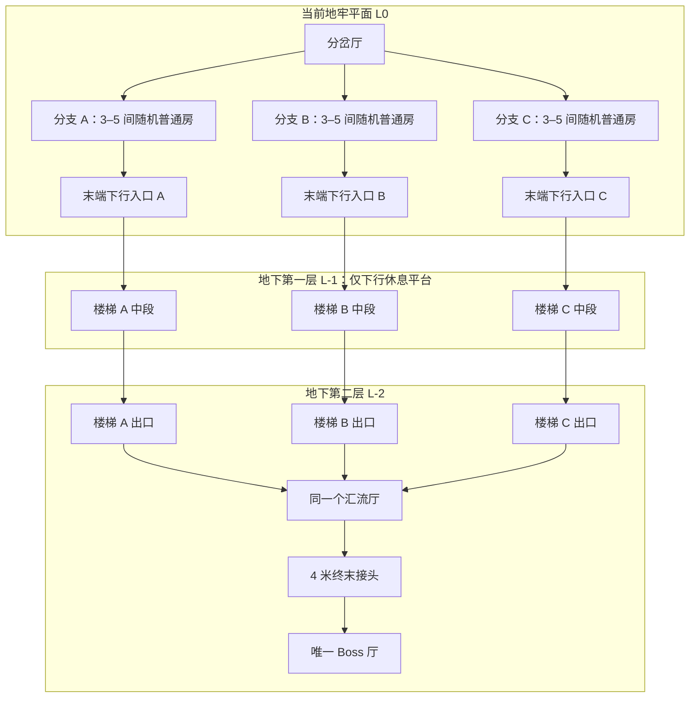

# 地下二层 Boss 终点：紧凑错层路线算法 V2（方案）

日期：2026-09-23。状态：算法设计，尚未修改运行生成器、制作楼梯资产或执行测试。

## 1. 设计意图与现状

把当前探索平面记为 L0。普通房探索仍在 L0；最终 Boss 厅地面在 L-2，三条分支的末端各自通过短连接和折返楼梯下行，再在 L-2 的同一个汇流厅进入唯一 Boss 门。L-1 是下降途中的休息平台层，本版不额外增加一整层探索房间。

核心指标是玩家从最后一个普通房出口到 Boss 门的实际行走距离。楼梯的斜向行程、转弯平台、汇流厅内部路径都计入，不能只计算平面投影。

当前代码中的长连接来源：

- `AuthoredDungeonRouting.inl::ReserveBoss` 把汇流入口固定为 `Center + Forward * 22000`，即距分岔中心约 220 米，再把 Z 设置到普通房所在平面。
- `FPlan::Overlap` 只判断 XY 交叠；上下层相同投影也会被视为冲突。
- `RouteTo` 的状态和避障是二维的，节点 Z 始终等于起点 Z。
- `Build` 先预留远端 Boss，再让三条分支向各自扇区向外生长，最后补接；走廊搜索没有玩家路程上限。
- 目录目前 `branch_links=6`、`group_links=3`，4 米连接段对应分支前导 24 米、组尾 12 米。这些固定空走距离也应改为满足门洞连接所需的短段。

## 2. 空间组织与建议初值



### 层高

建议首版相邻基准层间距 5.4 米：`Z1=Z0-540 cm`，`Z2=Z0-1080 cm`，全部以本局入口平面为基准，不能直接写世界 Z=-1080。

选择这个初值有两点依据：

1. 现有 Boss 外壳上界约 8.65 米，下降 10.8 米后，最高结构在 L0 以下约 2.15 米，为上层地板、低位管道与地下构造留出空间。
2. 沿用工业楼梯的 15 cm 踏步高、30 cm 踏步深，每层两跑、每跑 18 级恰好下降 5.4 米；两层共四跑。楼梯净宽 3 米，转身平台净深至少 1.8 米，按现有 HandBrain 大体型导航配置设计。

5.4 米是待制作尺寸，不是“任意位置一定无碰撞”的保证。对上层深坑、下垂构件和 Boss 屋顶必须做实际三维占位约束。首版通过换候选位置或回溯上层房间处理，不临时拉高房顶、压扁 Boss 厅或更改楼梯坡度。

**Boss 厅高跨两层。** 它会占据 L-1 的一部分高度，因此 L-1 的楼梯和休息平台应在大厅完整体积之外。Boss 厅内部原有 3.6 米高的二层钢架仍属于这个大厅，不把它当成外部 L-1 公共走廊。

### 路程预算（首版建议，非实测结果）

| 指标 | 建议值 / 规则 |
| --- | --- |
| 最后一个普通房出口 → Boss 门，总行程 | 目标 50–60 米，硬上限 65 米 |
| 上述路径中的水平连接、汇流厅内部和终末接头合计 | 不超过 28 米 |
| 普通房出口 → 下行入口 | 优先直接对接，最多 4 米短段 |
| L-2 楼梯出口 → 汇流厅入口 | 优先直接对接，最多 8 米短段 |
| 连续无内容直行距离 | 不超过 12 米；通过转角折叠仍受总行程上限约束 |
| 分岔厅外固定前导 | 由原 24 米改为按端口净空选 4–8 米 |
| 最终汇流厅 → Boss 门 | 沿用一个 4 米接头 |
| 普通房数量 | 保留每组 3–5 间，不为缩短终末连接删房 |

四跑楼梯的斜线长度本身约 24.15 米，另有转身平台和进出楼梯的距离。楼梯资产必须记录真实中心线长度，最终按该数据计费；外观折叠后占地变小不等于行走距离为零。

## 3. 先布置终点，再约束普通房向终点收拢

推荐采用“终点候选 + 分支双向生长 + 分层端口寻路”的联合方案。

### 步骤 A：保持原有拓扑与随机内容

先抽取主线与三条分支各自的房间数量，固定本次尝试的内容合同。入口段与分岔厅仍按当前完整作者房间生成。

所有房间仅做刚体旋转和平移，保持现有五种普通房风格、尺寸、两端门洞和宝箱侧室概率。布局、终点候选和装饰采用不同随机流，随机流包含生成器版本；同版本、同目录、同种子按稳定顺序重现。

### 步骤 B：产生紧凑终点候选

取消 220 米远端锚点。在分岔厅前方的探索区域内采样有限个 Boss 厅 XY 候选及四个正交朝向，优先考虑普通房区下方。候选半径是搜索偏好，不取代后面的行程硬约束。

每个候选是一个完整包：

`Boss 厅 L-2 + 4m 接头 + 汇流厅 L-2 + 三组两层折返楼梯 + 三个 L0 接入口`。

先在纯数据中为整个包预留结构、行走净空和端口接缝。三组楼梯分别接汇流厅的三个输入口；其竖井位于 Boss 厅之外。它们允许与普通房发生 XY 投影重叠，但上下结构和净空不得在 Z 上相交。

这一步提前给三条分支指定“附近的下行终点”，防止普通房全部向远处长完以后，再用长走廊追补。

### 步骤 C：三条分支双向生长

每条分支既从分岔厅出口向前生成，也从其下行入口反向预放最后 1–2 间普通房。两端使用相同房间池、端口匹配和三维占位规则，最后在中间用有长度预算的短连接接合。

原先只许向外的扇区限制改为：

- 分支的前部有各自的探索区域偏好，用于保持三条路线的辨识度。
- 后部随剩余房间数减少，提高靠近指定下行入口的优先级，允许借真实转角模块转向并形成 U 形或弧状路线。
- 分支之间不产生未声明的门口对接或走廊交叉，避免从前段直接绕进终点。
- 搜索记录房间数量、剩余连接预算和已占空间。相同进度保留少量较优候选（beam），避免第一种排布失败就补一条远绕走廊。

方向不能通过旋转门洞元数据强改：只有完整房间已有的端口，或已经制作的转角模块，才能让路线转向。中段无法接合时，先回溯最近 1–2 间房，再换整个终点候选。

### 步骤 D：在真实楼层图上搜索连接

搜索状态：`(位置节点, 所在基准层, 朝向, 已用预算)`。

允许的边只有：

- 同层直线连接段；
- 有真实占位的 90° 转角模块；
- 指定楼梯模块的成对入口/出口，其两端 Z 不同。

不允许把任意上下重叠节点直接连成竖直边。只有实际楼梯和休息平台才能建立楼层转换；接头、门框和行走净空作为整段体积参加搜索。

路径代价使用作者中心线长度，另加转弯和额外连接段的轻量偏好成本。任何一条末端路线超过预算，候选直接拒绝。启发项用两端的三维直线距离等保守下界；转弯偏好不能把一个实际超长方案判为合格。

三条连接联合提交。遇到顺序依赖时，枚举三条分支的最多 6 种连接顺序，或回溯已选连接；不能固定第一条总是抢占最好位置。

## 4. 三维占位规则

扩展现有 `cells`，分别记录：

- `solid_cells`：地板、墙、顶、楼梯井边界和大厅结构占位；
- `walk_clearance_cells`：楼梯、平台、门洞及转弯所需的角色净空；
- `ports`：位置 XYZ、朝向、宽高、所属层和允许连接类型；
- `walk_polyline`：从端口进入模块后真实可走的中心线；
- `portal_join_cells`：门洞拼接允许共享的局部边界。

宽阶段按 XYZ 包围盒筛选，窄阶段逐个实际 cell 判断。不同层只在真实 Z 区间相交时产生冲突；不能仅比较 `floor_index`，因为 Boss 房和楼梯跨层。

相邻模块允许的交叠限制在门洞接缝盒内，不能因为连接到某个 Owner 就忽略整间房的冲突。楼梯斜上方要留完整胶囊净高，起步区、折返平台和出口应纳入净空。

## 5. 接受标准与候选评分

先按硬约束过滤：唯一 Boss、三分支均有完整通路、房数保持、接口合法、无三维结构/净空冲突、总路程及空走段不超限。

对剩余候选按以下次序择优：

1. 最长一条末端路线更短，避免某个分支被牺牲；
2. 三条末端路线总行程更短；
3. 新增空走连接段更少；
4. 在质量相近的合格候选中用种子抽取，保留变化。

不要使用“最小化新增走廊总长度”单一指标：复用一段长公共走廊虽然省模型，却可能让每位玩家都多走一段。

搜索有统一预算：初版可从 12 个终点候选、每状态保留 16 个分支排布、每次 50,000 次节点展开上限开始。具体数值是实现初值，仍需后续实际生成耗时调整。预算耗尽时输出明确生成失败；不放宽距离上限、延长楼梯、偷偷删房或恢复旧 220 米兜底。

## 6. 伪代码

```text
GenerateV2(seed, catalog):
    counts = SampleRoomCounts(seed, 3..5)
    prefix = PlaceApproachAndJunction(counts.approach)
    candidates = MakeTerminalCandidates(prefix, floorOffset=-1080)

    solutions = []
    for terminal in StableSeededOrder(candidates):
        plan = Clone(prefix)
        if !ReserveTerminalAndStairVolumes3D(plan, terminal): continue

        result = EmbedBranchesBidirectionally(
            plan, prefix.branchPorts, terminal.upperStairPorts,
            counts.branches, authoredRoomPool, nodeBudget)
        if result.failed: continue

        if !ConnectAllBranchesWithLayeredPortSearch(plan, terminal): continue
        routes = MeasureFinalRoomDoorToBossDoor(plan, authoredWalkPolylines)
        if !SatisfyHardLayoutContracts(plan, routes): continue
        solutions.add(plan, LexicographicScore(max(routes), sum(routes), connectorCount))

    chosen = SeededChoiceAmongNearBest(solutions)
    if !chosen: return GenerationFailureWithReason
    AddOptionalTreasureRooms(chosen, independentSeed)
    AddDressing(chosen, independentSeed)
    return chosen
```

这里的硬约束判定是生成算法的一部分，不代表本轮执行了测试或验收。

## 7. 在现有项目中的落点

| 单元 | 计划改动 |
| --- | --- |
| `AuthoredDungeonGenerator.cpp / FPlan` | 三维占位、楼层数据、双向分支生长、按预算选择连接、统一搜索上限 |
| `AuthoredDungeonRouting.inl` | 替换固定远端 `ReserveBoss`，增加终点包候选和有真实楼梯边的分层路由 |
| Boss / 连接目录 | 保留现有 Boss 厅，新增 `StairDrop540` 及适用镜像/旋转接头，记录端口 XYZ、净空和真实中心线长度 |
| 模块作者脚本 | 制作一个可重复使用的工业折返楼梯母版；两份组成一条下降两层的路径，不对现有房间做竖向拉伸 |
| 装配与导航 | 沿用暂存后整体提交；导航体覆盖完整 Z 范围，楼梯连续支撑面及 HandBrain 大体型配置共同参与导航 |
| `DungeonBossEncounter` | 整个遭遇和内部二层随房间变换下移，保留原触发、关门、掉落、复位与 AI 修正 |
| 布局清单 | 增加生成器版本、层高、各房层号/体积、三条终末实际行程、最长空走段、拒绝原因；精确坐标与碰撞仍以三维数据为准 |

实施顺序：先落实目录/楼梯端口和三维占位，再实现候选与分支联合排布，最后进行后台模块制作、编译、导入与接入。旧存档/既有布局不应仅凭原 Seed 被解释成新版本；本方案未新增正式存档系统。

本轮仅交付算法方案。没有改动现有运行布局、编译、启动 UE 或进行种子/导航/画面测试；上述路程预算尚无游戏实测结论。
