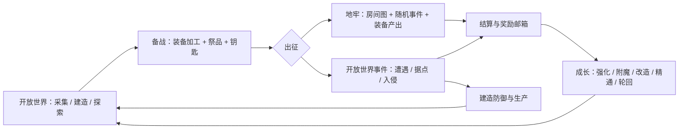
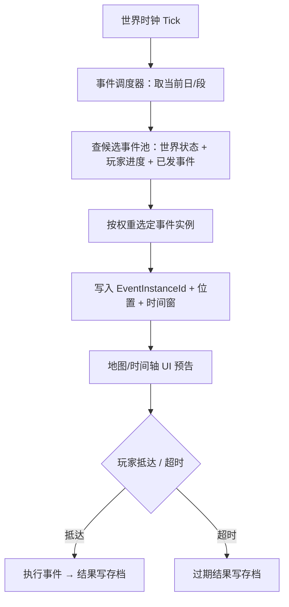

# 无尽轮回 FPS · 玩法开发案

版本 v1 · 2026-09-18 · 宿主工程 `D:/FPS3D/FPSGAME`（UE 5.8.2）

本文是**后续玩法的策划案与开发路线**，首批两大支柱：**地牢探险（装备驱动 + 随机事件）**、**开放世界探险（动态事件 + 建造）**。本文只做设计与排期，不含代码改动。

## 0. 阅读方式与边界

- 按现行规则，本文没有启动游戏、没有跑回归、没有做视觉验收；文中的「现状」全部来自源码与数据文件的静态阅读，实际手感由用户判定。
- 术语与数值优先沿用**工程内已存在的口径**，不另起一套：`Content/ColdSteelData/items.json` 的 A–F 级时空锚点代币与六档时空祭品、`Content/ColdSteelData/status_effects.json` 的「本次地牢」效果、`Source/FPSGAME/UI/ColdSteelStatusModel.h` 的祭品与地牢增益接口。
- 标记约定：**【现有】**= 工程内已实现；**【旧版】**= 旧 project(`E:/无尽轮回/长期备份/2026-7-13-1/game-dev`) 已定稿、可直接迁移设计；**【新增】**= 本方案要求新建。

## 1. 目标与三条红线

目标体验：**枪械手感 + 装备驱动成长 + 可建造的开放世界 + 可预告的世界事件**。玩家在开放世界里采集、建造、防守，在地牢里用装备和准备度换产出，产出再回到开放世界。

| 红线 | 含义 |
| --- | --- |
| 不推翻已验收合同 | 战斗公式、冷钢 UI、事务性存档、武器/手臂动画时序不动。新玩法挂在既有入口上，不平行造第二套。 |
| 装备驱动必须落在既有数值链 | 产出只有经「强化 / 附魔 / 改造 / 精通 / 套装 / 祭品」才转为战力；不新建第二套属性系统。 |
| 随机必须可复现、可存档 | 同一 WorldId + Seed + GeneratorVersion 重建同一世界与同一地牢；事件实例有稳定 ID，读档不刷新结果。 |

## 2. 现状基线（可直接复用的系统）

| 能力 | 现有实现 | 本方案如何使用 |
| --- | --- | --- |
| 战斗与数值 | `Source/FPSGAME/Combat/`：`CoreCombatFormula`、`CombatFormulaRuntime`、`WeaponDamageTypes`、`ColdSteelFormulaBonuses` | 地牢/事件的伤害、难度、奖励系数全部走这里 |
| 状态效果 | `Content/ColdSteelData/status_effects.json` + `UI/StatusEffectsComponent`（眩晕/中毒/矿毒/腐蚀/冻结/感电…） | 地牢事件、动态事件、天气惩罚直接复用 |
| 装备成长 | `UI/ColdSteelEnhancementSystem`（强化/附魔/改造工作台）、`Weapons/GunsmithSystem`、`Content/ColdSteelData/gunsmith.json`、`melee-gunsmith.json` | 「装备驱动」的加工端已完整，缺的是**产出端** |
| 技能与精通 | `Skills/ColdSteelSkillModel` + `Content/ColdSteelData/skills.json`（13 项：暴击、手枪/步枪/机枪/散弹枪/弓/剑精通、巧手、闪避、火球、冰锥、重击、快速进战） | 地牢产出可定向喂精通与技能修炼 |
| 祭品 / 地牢增益 | `OfferTribute`、`TributeEffect`、`DungeonEffect`、`ApplyDungeonFormulaBuff`、`CompleteDungeonFormulaBattle`（`Combat/ColdSteelFormulaBonuses.cpp`） | **出征准备系统的地基已经存在**，只缺出征流程与 UI |
| 战利品道具 | `items.json`：`anchorTokenA–F`（地牢钥匙）、`tribute_*` 六档、`craft_*` 祭品、强化石/改造券/魔法粉尘 | 钥匙经济与祭品池直接沿用 |
| 怪物与 AI | `Monsters/`：FatZombie、NurseZombie、Mutant3、WolfMonster、HandBrain（恐惧 AI + 村庄刷怪）、PoisonMaggot（刷怪/投射物/毒雾）+ `MonsterAIController`/`MonsterBTNodes`/`MonsterCombatComponent` | 地牢波次与开放世界遭遇的怪物源 |
| 开放世界地形 | `WorldGeneration/TemperateHills*`（运行时高度场 + PCG 分层 + 河流生态 + 流送 + 远景）、`TerrainDestruction` | 动态事件的发生地；地形破坏已可用 |
| 建造 | `Building/VoxelBuild*`：20 cm 体素、材质强度、承重求解、过载损伤与倒塌、残骸回收、构件（门/双开门/窗/喷泉）、按「档案+地图」存档 `Voxel20_<md5>.sav` | 开放世界建造支柱已可玩，缺的是**玩法目的**（防御、生产、据点评级） |
| 天气与时间 | `FPSWeatherManager`：`RealSecondsPerGameDay = 2160`（现实 36 分钟 = 1 游戏日）、每日 8 段、`GetScheduledStateAt(Day, Segment)` 预报、雷暴/积水/遮蔽 | 动态事件的时间轴数据源 |
| 事件时间轴 UI | `UI/ColdSteelEventTimeline.cpp`：缩略轨道 + 展开详情 + 筛选 + 未来 5 日窗口，已有「入侵情报」占位行 | **动态事件的展示面已经建好**，只接数据源 |
| 世界时钟 | `UI/ColdSteelWorldClock`（日 + 日内进度，只读） | 事件预告、地牢外活动窗口 |
| 关卡切换 | `SceneTestPortal.cpp` + `USceneTestPortalSubsystem` + `UI/TransitLoadingSubsystem`（带进度与取消的转场遮罩） | 地牢入口与返回的现成通道 |
| 存档事务 | `UI/ColdSteelStatusModel`（`ProposeX` / `CommitProposal` / A-B 双槽 + Generation）、`ColdSteelProfileRuntime` | 奖励、掉落、破坏一律走事务 |
| UI 规范 | `Docs/UI/ui-cold-steel-design-system.md` v2.17、`UI-WORKFLOW.md`、`Docs/UI/panel-column-plan-template.md` | 新面板必须先规划后制作 |

### 2.1 缺口清单（P0，两支柱共同依赖）

| # | 缺口 | 现状 | 影响 |
| --- | --- | --- | --- |
| G1 | **WorldId / 世界种子未进存档** | `Docs/WorldGeneration/pcg-world-design-20260912.md` 第 2 节已记录：掉落按「当前地图名」恢复，没有独立世界 ID | 同一宿主地图的不同随机世界会串档；地牢种子无法复现 |
| G2 | 没有地牢配置与房间图数据 | UE 侧只有道具与状态效果，没有 dungeon/room/event 数据文件 | 地牢支柱无数据底座 |
| G3 | 没有掉落表与词缀池 | `items.json` 有稀有度（common→mythic）与属性字段，但没有掉落权重/词缀表 | 「装备驱动」缺产出规则 |
| G4 | 没有结算与奖励邮箱 | 旧版有 `RewardSystem`/`BossRewardSystem`/`RewardNodeManager`；UE 侧没有 | 地牢产出无法安全落地（背包满、超时返回） |
| G5 | 没有事件调度器 | 时间轴 UI 只有天气一个数据源 | 动态事件无驱动 |
| G6 | 建造开放地图硬编码 4 张 | `UVoxelBuildComponent::TryInitializeWorld`；`Docs/Backlog.md` 第 11 条已登记 | 新地图（地牢、新区域）不能建造 |
| G7 | 地牢专用关卡不存在 | 现有可玩地图只有 `DayNight_Lighting`（枢纽）、`L_Normandy_FPS_Test`、`L_MilitaryTrench_FPS_Test`、`L_TemperateHills_Initial` | 需要一个独立地牢宿主 |

## 3. 玩法总图

两条支柱共享同一底座：**角色与公式、怪物池、世界时间与天气、事务性存档、冷钢 UI、关卡切换**。任何一条支柱都不新建平行底座。

---

# 支柱一：地牢探险（装备驱动 + 随机事件）

## 4.1 体验定位

地牢是**可控风险的高回报场**：进去之前玩家自己决定装备、祭品、钥匙档位；进去之后房间图与事件提供不可控变量。核心张力来自「准备度 vs 期望收益」，而不是单纯的关卡难度。

目标节奏（草案，待实测校准）：一次 F/E 级地牢 8–15 分钟，D/C 级 20–30 分钟，A/B 级 35–50 分钟。

## 4.2 出征循环

| 步 | 内容 | 接入点 |
| --- | --- | --- |
| 1 备战 | 在开放世界据点检查装备、强化/附魔、挑选祭品 | 现有强化工作台 + 冷钢背包仓库 |
| 2 献祭 | 祭品本场生效（现有规则：同稀有度互斥、1800 秒计时） | 现有 `OfferTribute` |
| 3 消耗钥匙 | 按档位消耗 1 枚 `anchorTokenA–F`（背包优先、仓库兜底） | 现有 `ConsumeItem`（全有或全无事务） |
| 4 转场 | 走带进度与取消的转场遮罩进入地牢宿主 | 现有 `UTransitLoadingSubsystem` |
| 5 探索 | 房间图推进：战斗房 / 事件房 / 宝箱房 / 精英房 / BOSS 房 | 【新增】房间图运行时 |
| 6 撤离或阵亡 | 主动撤离按已清房间结算；阵亡按规则损失 | 【新增】结算器 |
| 7 归位 | 战利品进背包或奖励邮箱；地牢进度写入存档 | 【新增】奖励邮箱，复用事务存档 |

**进入提交点**（旧版已定稿的教训）：献祭与钥匙扣除必须在**地图加载成功之后**确认；加载失败要回滚祭品与钥匙，不能出现「钥匙没了但没进去」。旧版 `E:/无尽轮回/长期备份/2026-7-13-1/game-dev/skill/06-dungeon-scene.md` 的「地牢进入提交点与异常返回」一节可直接作为迁移依据。

## 4.3 钥匙阶梯与难度档位

工程内钥匙**只有道具定义，没有档位规则**。以下档位优先复用旧版 `game-dev/data/dungeon-config.json` 的 `dungeonList` 已定稿数值（等级、节点数、战斗比例、奖励、推荐等级、解锁链）：

| 档位 | 代币（稀有度） | 旧版同级地牢 | 节点数 | 战斗节点占比 | 推荐等级 | 金币基准 | 解锁前置 |
| --- | --- | --- | --- | --- | --- | --- | --- |
| F | `anchorTokenF`（common） | 废弃矿洞-初级 | 5（含入口，固定教学线） | 教学线 | 1–10 | 800 | 新轮回由「小鼠大王」送 1 枚 |
| E | `anchorTokenE`（uncommon） | 废弃矿洞-中级 / 沼泽-初级 | 30–35 | 50% | 10–25 | 1200–3000 | 上一档 |
| D | `anchorTokenD`（rare） | 废弃矿洞-高级 / 沼泽-中级 | 45–50 | 50% | 25–40 | 1500–5000 | 上一档 |
| C | `anchorTokenC`（epic） | 恐怖地牢-初级 / 沼泽-高级 / 恶魔洞窟 | 22–60 | 50% | 40–55 | 2000–8000 | 无前置（入门级系列） |
| A | `anchorTokenA`（legendary） | 恐怖地牢-高级 / 雪山-高级 | 45–70 | 50% | 70–85 | 20000 | 上一档 |
| B | `anchorTokenB`（mythic） | 恐怖地牢-中级 / 雪山-中级 | 30–65 | 50% | 55–70 | 13000 | 上一档 |

⚠ **待决策 D1**：旧版把 B 定为「中级」，而当前 `items.json` 里 B 的稀有度是 mythic（高于 A 的 legendary）。3D 版要么把 B 重新定义为最高档，要么把代币稀有度对齐旧版阶梯。这与 `tribute_mythic` 的属性低于 `tribute_legendary`（+15% vs +22%）是同一类不一致，建议一次性拍板。

**系列主题**（旧版已落地，可直接继承）：废弃矿洞、恐怖地牢、雪山、沼泽、恶魔洞窟。每个系列有自己的怪物池、墙体套件、环境小物与随机事件倾向；系列内分初级/中级/高级。

## 4.4 装备驱动

### 掉落分层

| 层 | 内容 | 规则 |
| --- | --- | --- |
| 稳定层 | 金币、强化石、魔法粉尘、改造券、建材 | 每房固定给，按档位放大；保证「刷一趟有收获」 |
| 随机层 | 武器/护甲/祭品，带稀有度与词缀 | 按档位权重表；受玩家**已解锁系列**影响 |
| 目标层 | 定向产出（指定词缀、指定件） | 用代币或保底机制换取，避免纯概率挫败 |

### 与既有数值链的接口

产出物只允许落到现有加工端：

- 装备 → `ColdSteelEnhancementSystem` 强化/附魔 → `GunsmithSystem` 改造 → 精通修炼。
- 祭品 → `OfferTribute`（本场/限时增益）。
- 材料 → 现有 `ConsumeMaterial`/`CountMaterial`（背包 + 仓库合计口径）。

**不允许**新掉落自带一套独立加成字段，否则会与 `CoreCombatFormula`、`ColdSteelItemTooltipFormula`、武器伤害面板三处口径分叉。

### 词缀与旧版接口

旧版每件装备已有词缀与套装概念（`armorSet` 在 UE 侧已支持 `SetEffect`：light/holy/flowing/heavy/zhenyue/oracle/stellar/tiangang 等套装）。地牢词缀池应当**只使用这些既有 key**，新增 key 必须先加进公式层再进掉落表。

## 4.5 随机事件

事件是地牢的「第二个随机轴」，与房间图随机解耦，便于分别调试。旧版 `dungeon-config.json` 的 `events` 已经定稿，可直接迁移内容与规则：

| 事件 | 类型 | 玩家选择 | 检定 | 结果 |
| --- | --- | --- | --- | --- |
| 古老女神像 | 增益/治疗 | 祈求恢复 / 请求祝福 / 接受馈赠 | 无 | 回满生命魔法 / 攻击 +15% 持续 3 场 / 强化石+改造券+粉尘 |
| 古老陷阱 | 风险 | 解除陷阱 / 强行跨越 | 敏（25%）/ 体（30%） | 成功无声通过；失败扣最大生命 25% |
| 冒险者遗物 | 情报/补给 | 仔细搜寻 / 探查四周 | 智（40%）/ 敏（35%） | 补给品 / 揭示后方 2 层地图（`revealDepth`） |
| 恶魔像 | 交易 | 献祭换强化 | 无 | 高收益 + 代价（对应现有「恶魔祈祷」状态） |
| 宝箱房 | 精英专属 | — | 无 | 精英战斗胜利后才能开；旧版 `chest-room-system.js` 定稿 |

**属性检定规则**（旧版 `attributeCheck` 已定稿）：基础成功率 20%，属性乘数 1，成功率夹在 5%–95%，高于 80% 进入软上限、低于 20% 进入软下限。这套规则与现有六维（力/敏/智/体/感/运，`str/dex/intt/con/wis/luck`）自然对接，并让「加点」在战斗之外有意义。

**分布规则**（建议，需实测）：每层事件房数量按档位上/下限约束；同类型不连续出现；一局至少保底 1 个增益类与 1 个风险类；事件结果一旦结算即写入存档，读档不回滚。

## 4.6 房间图与地牢生成器

**【新增】** UE 侧没有房间图系统。建议采用「节点图 + 房间模板」而不是逐格程序生成：

1. **图生成**：按档位节点数生成连通有向无环图 + 20–30% 回路（避免唯一死路，与 PCG 大世界同一哲学）；入口到 BOSS 的最长路受控。
2. **节点分配**：战斗 / 事件 / 宝箱 / 精英 / BOSS / 入口，比例按档位（旧版战斗占比 50%）。
3. **房间模板**：战斗房尺寸固定档位（旧版 `combatRoom`：普通 1024 / 精英 1792 / BOSS 2048 px，墙厚 20，怪物出生距墙 ≥150 px）。UE 侧需按玩家移动速度与武器有效射程重定米制尺寸（草案：普通 ≈ 24×24 m、精英 ≈ 40×40 m、BOSS ≈ 52×52 m，**属草案，待实测**）。
4. **门控与波次**：清房开门；精英/BOSS 房锁门并走波次；波次表按怪物池与档位取。
5. **连通性校验**：生成失败按固定 `AttemptIndex` 换子种子，最多 8 次，仍失败则报错——不悄悄降级成不可达地图（沿用 PCG 大世界的同一规则）。

**种子**：`DungeonSeed = StableHash(WorldSeed, DungeonId, Tier, AttemptIndex, GeneratorVersion)`；房间/事件/掉落各自派生稳定子种子。

**地形与资产**：地牢地貌用 **Static Mesh + 模块化墙体套件**，不使用已退役的体素地形（见 `trash/voxel-terrain-retired-20260916/`）。20 cm 建造体素是**另一套语义**，只在玩家建造时使用。地牢内的可交互门/窗可直接复用现有 `ColdSteelDoor` / `ColdSteelWindow` / `ColdSteelFountain` 构件。

## 4.7 出征准备与祭品

现有能力已经足够支撑「准备度」这一层：

- `OfferTribute(ItemId)`：消耗背包中 category = `tribute` 的物品，写入 `FormulaBuffs`，`bTribute=true`，1800 秒；同稀有度互斥（换新的顶掉旧的）。
- `status_effects.json` 里已有一组「本次地牢/祭品」语义的效果：雪莲祝福（经验 +25%）、人参回气、蟠桃续命（死亡后 3 秒 30% 生命复活一次）、金刚不坏、月影庇护、点石成金等，另有女神祝福、恶魔祈祷等战斗期增益。
- `ApplyDungeonFormulaBuff` / `CompleteDungeonFormulaBattle`：**按「场数」计的地牢增益已经有实现**，正好对应「一局地牢打 N 场战斗」。

需要**新增**的只有三件：出征确认面板（选钥匙档位 + 选祭品 + 看收益预览）、进入时把祭品与钥匙纳入同一次提交、结束后结算生效场数。

## 4.8 结算与失败

| 场景 | 处理 |
| --- | --- |
| 正常到 BOSS 并击杀 | 全额结算 + BOSS 奖励 + 本局事件收益汇总 |
| 主动撤离 | 结算已清房间的收益，未清房间作废；钥匙不返还（防止刷图） |
| 阵亡 | 按规则损失（建议：保留事件奖励、损失本局稳定层收益），有「蟠桃续命」类祭品时消耗复活 |
| 异常返回（拔线/加载失败/进程崩溃） | 进入提交点回滚，不复制奖励、不吞钥匙 |
| 背包满 | **奖励邮箱**承接（旧版 `RewardSystem`/`RewardNodeManager` 的成熟做法） |

奖励必须走一次事务提交：道具入包 + 经验 + 精通修炼 + 世界状态一次写入，写入失败则全部不生效（沿用现有 A/B 世代 + Generation 校验思路）。

## 4.9 UI 规格

所有面板按 `UI-WORKFLOW.md` 先出规划文档，再按 `ui-cold-steel-design-system.md` 制作。

| 界面 | 建议形态 | 说明 |
| --- | --- | --- |
| 出征面板 | 右侧抽屉（与背包/状态同规格：视口 48%、720–1040px） | 钥匙档位选择、祭品槽位、预期收益与风险预览、消耗汇总 |
| 地牢地图/进度 | HUD 常驻小图 + F/快捷键展开 | 显示当前层房间图、已清节点、事件房未读标记 |
| 事件卡 | 屏幕中下方的冷钢玻璃卡 | 标题 + 描述 + 2–3 个选择 + 成功率（走 `attributeCheck`） |
| 结算面板 | 居中玻璃面板 | 收益明细（基础/随机/目标三层）+ 事件收益汇总 |
| 奖励邮箱 | 主游戏右侧栏目入口新增第 4 个图标（现有 3 个：人物状态/背包/技能） | 入口尺寸 88×88、间距 25px、悬停 1.25 倍，沿用同规格 |

## 4.10 数据规格

建议新增 `Content/ColdSteelData/dungeon/`：

| 文件 | 内容 |
| --- | --- |
| `dungeon-series.json` | 系列（主题/墙体套件/怪物池/事件倾向/解锁链） |
| `dungeon-tiers.json` | F–B 档位（节点数区间、战斗占比、房间尺寸档、奖励系数、推荐等级、钥匙 ID） |
| `dungeon-rooms.json` | 房间模板（尺寸、门位、遮蔽物、出生点、波次表） |
| `dungeon-events.json` | 事件池（权重、选择、检定属性与基础率、成功/失败结果、`revealDepth`） |
| `loot-tables.json` | 掉落表（稳定层/随机层/目标层权重、保底） |
| `affix-pool.json` | 词缀池（只用公式层已支持的 key） |

## 4.11 技术接入点【新增】

| 类型 | 责任 |
| --- | --- |
| `UDungeonSessionSubsystem`（GameInstance） | 出征状态、钥匙/祭品提交、异常返回回滚 |
| `FDungeonLayoutGenerator` | 纯数值生成房间图（不依赖场景），可离线批量验证 |
| `ADungeonRoomActor` | 单个房间的加载/门控/波次/事件挂载 |
| `UDungeonRoomRegistry` / `UDungeonEventResolver` | 模板与事件解析、结果落库 |
| `URewardMailboxSubsystem` | 背包满时的奖励承接与领取 |

地牢宿主关卡建议独立（例如 `/Game/GameMaps/L_DungeonHost`），入口复用 `ASceneTestPortal` + `UTransitLoadingSubsystem`，不塞进开放世界地图。

---

# 支柱二：开放世界探险（动态事件 + 建造）

## 5.1 体验定位

开放世界提供**长期目标与不可预测性**：世界会自己发生变化（天气、遭遇、据点、入侵），玩家的应答手段是**建造**与准备。与地牢的分工是：地牢赌一局，开放世界积累。

## 5.2 三段时间轴

| 尺度 | 驱动 | 现有能力 |
| --- | --- | --- |
| 实时（秒–分） | 遭遇、天气突变、地表变化 | `FPSWeatherManager`（转场 8 秒、雷雨前置 30 秒）、`TerrainDestruction` |
| 日周期（36 分钟 = 1 日，8 段） | 昼夜、刷怪强度、事件窗口 | `RealSecondsPerGameDay = 2160`、`GetScheduledStateAt`、`ColdSteelWorldClock` |
| 五日周期 | 入侵战役、据点威胁、世界 Boss | **时间轴 UI 已有「未来 5 日」窗口与「入侵情报」占位** |

## 5.3 动态事件分层

| 层 | 事件 | 触发 | 玩家应答 |
| --- | --- | --- | --- |
| 环境 | 雷暴、大雾、积水、夜里降温 | 天气调度（已有） | 遮挡、换装、避开低洼 |
| 遭遇 | 尸群、狼群、手脑怪恐惧领域、毒蛆巢 | 世界实体网格 + 现有各 Spawner | 战斗、绕行、引诱 |
| 据点 | 村庄被袭、补给点被占、商人受困 | 位置 + 时间 + 威胁度 | 支援、防守、事后重建 |
| 采集 | 树生长、矿脉、地表可挖区 | 现有 `ProductionHarvestSubsystem`（树生长已有） | 生产工具采集 |
| 入侵 | 五日推进的兵线、侦察预警、防守战 | 世界时钟 + 事件调度器 | 建造防御、参战、转移 |
| 世界 Boss | 高阶威胁，需集结 | 长周期 + 进度门槛 | 准备与挑战 |

**旧版可直接迁移的成熟结构**（`game-dev/data/invasion-campaign.json`）：

- `march`：提前 1 天出发、出生距离下限/上限；
- `recon`：侦察半径、侦察单位类型、边境政策、预警建筑（天气预报塔 / 位面观测阵列）提供额外预警半径；
- `formation`：普通兵/精英兵基数与成长上限、批次规模、威胁值曲线。

## 5.4 动态事件调度器【新增】

关键规则：

1. 事件实例用 `EventInstanceId = StableHash(WorldId, DaySerial, SlotIndex, EventType, AttemptIndex)`，读档后同一日同一格不会再抽一次。
2. 事件状态三态：`预报 / 进行中 / 已结算`，只有前两态可显示。
3. 玩家不在场的事件也必须推进（超时即结算），否则「无视世界」就没有代价。
4. 天气事件不重生成世界布局（沿用 PCG 设计文档第 7 节：天气只驱动材质与表现）。

## 5.5 建造玩法延伸

现有建造系统已经是**完整可玩的物理建造**（20 cm 体素、材质强度、承重求解、过载损伤、倒塌、残骸回收、构件门/窗/喷泉、按地图存档）。缺的是**建造的理由**。建议四层目的：

| 目的 | 机制 | 复用 |
| --- | --- | --- |
| 生存 | 遮雨、保暖、挡怪 | 天气遮蔽量（`GetRainExposure`）、怪物寻路 |
| 防御 | 城墙、塔位、射击位、门口 | 承重/倒塌已是真实物理；防御塔位作为预制件 |
| 生产 | 生产设施、储物、加工位 | 现有仓库；生产掉落（`ProductionHarvestSubsystem`） |
| 据点 | 建造规模 → 据点评级 → 解锁交易/任务/科技 | 【新增】评级与解锁 |

**与事件的耦合**（这是让建造有意义的关键）：入侵/据点事件会**破坏建筑**，玩家要修；`Docs/Backlog.md` 第 14 条「残骸回收比例」正是这里需要一个经济决策——建议引入「倒塌损耗」回收率（例如 50%），让「被打坏」真的付出成本，而主动拆除仍全额返还。

**已知需要先处理的边界**：

- 建造开放地图硬编码 4 张（Backlog 第 11 条）→ 新地图（新区域、地牢外营地）必须改成数据驱动。
- 构件（罗马柱、栏杆）目前**免料**、不参与承重（Backlog 第 16 条）→ 若要用作防御工事，必须先定义物品并接入扣料。
- 过载无音画反馈（Backlog 第 8 条）→ 防守战里玩家必须能感知结构即将失效。

## 5.6 探索与发现

【旧版】`fog-of-war.json`（战争迷雾：未探索/已探索、门是否挡视线、夜间视距减半）可作为 3D 版的规则参考，但 3D 侧建议**不做格子迷雾**，改为：

| 机制 | 建议 |
| --- | --- |
| 发现 | 走到视野内 + 有视线即「发现」POI，写入世界状态 |
| 地标 | 制高点、桥、废墟、矿口在图上有名字，作为导航锚点 |
| 地图 UI | 发现后才显示；未发现区域留空而不是涂黑格 |
| 引导 | 用世界内线索（烟、声、光、NPC）而不是任务箭头 |

## 5.7 UI 规格

| 界面 | 说明 |
| --- | --- |
| 事件时间轴扩展 | 现有 `ColdSteelEventTimeline` 已支持未来 5 日、筛选按钮、事件详情弹层；**只需把数据源从「天气」扩展为「天气 + 事件」，并启用「入侵情报」行** |
| 地图/发现 | 建议作为右侧第 5 个栏目入口或 HUD 快捷键面板；走抽屉同规格 |
| 据点评级面板 | 显示建造规模、防御值、生产、需求 |
| 事件提示 | 复用现有 `PostNotice` 提示栏（顶部进度提示队列） |

**注意**：现有时间轴文档明确记录「不添加尚未接入的入侵事件或支援玩法」。接入事件调度器时，必须同步更新 `Docs/UI/event-timeline-plan-20260913.md` 的这条边界，不能只在代码里加数据。

## 5.8 数据规格

建议新增 `Content/ColdSteelData/world/`：

| 文件 | 内容 |
| --- | --- |
| `event-types.json` | 事件类型、权重、时间窗、前置条件 |
| `event-instances.json` | 具体事件内容（文案、选项、结果、奖励） |
| `invasion-campaign.json` | 兵线、侦察、阵型、威胁曲线（迁移旧版结构） |
| `poi-templates.json` | 据点模板与地标 |
| `settlement-tiers.json` | 据点评级与解锁 |

## 5.9 技术接入点【新增】

| 类型 | 责任 |
| --- | --- |
| `UWorldEventSubsystem` | 事件调度、实例 ID、状态机、存档 |
| `UWorldEventRuntime` | 单事件的场景表现与触发检测 |
| `UWorldDiscoverySubsystem` | 发现/地标/地图状态 |
| `USettlementRatingSubsystem` | 建造规模统计与据点评级 |

依赖方向：`UI → Session/Event`，`Event → 世界状态与实体`，`建造 → 世界状态`；事件系统不直接改背包，奖励仍走既有事务入口。

---

# 6. 共享底座改造（P0）

| # | 项目 | 现状 | 需要做什么 | 影响面 |
| --- | --- | --- | --- | --- |
| S1 | WorldId/Seed 进存档 | 无（PCG 文档已记录） | 世界头 + 差量 + 掉落按 WorldId 隔离；旧档保留原固定地图模式 | 存档、掉落、建造存档槽 |
| S2 | 事件调度器骨架 | 无 | 时钟 Tick → 事件池 → 实例 ID → 状态机 | 新子系统 |
| S3 | 掉落/奖励事务 | 有事务，无掉落表 | 掉落表数据 + 「背包满→邮箱」承接 | 背包、仓库、邮件 |
| S4 | 建造地图配置化 | 硬编码 4 张 | 迁到 DataAsset / 项目设置 | 建造组件 |
| S5 | 怪物池按档位 | 各 Spawner 各自写 | 统一怪物池定义（系列/档位/事件） | AI、地牢、开放世界共用 |
| S6 | 事件/地牢 UI 入口 | 3 个右侧入口 | 加第 4/5 个入口（邮箱、地图） | 冷钢 UI 规范 |

# 7. 开发路线

每阶段都给出「完成定义」。**按现行规则，完成定义由用户实测判定，不写成自动验收。**

## 阶段 0 · 底座（约 1–2 周量级）

| 任务 | 交付 | 依赖 |
| --- | --- | --- |
| S1 WorldId/Seed 存档 | 世界头结构 + 掉落按 WorldId 隔离 + 旧档兼容 | 无 |
| S5 怪物池数据化 | `monster-pools.json` + 现有各 Spawner 改为读池 | 无 |
| S4 建造地图配置化 | 建造地图从代码迁到数据（Backlog 11） | 无 |
| 开发工具 | F6 开发面板增加「地牢种子 / 事件日 / 强制事件」入口，便于调试 | 现有 `DevelopmentPanelWidget` |

**完成定义**：新开两个世界，掉落与建造互不串档；同一 Seed 重建得到同一布局摘要。

## 阶段 1 · 地牢最小闭环（约 2–3 周量级）

| 任务 | 交付 |
| --- | --- |
| D1 | F 级「废弃矿洞」教学地牢：5 节点固定线，手工布置房间模板 |
| D2 | 房间图运行时（节点图 + 连通 + 门控 + 波次） |
| D3 | 出征流程：钥匙扣除 + 祭品 + 转场 + 进入提交点 + 失败回滚 |
| D4 | 结算器 + 奖励信箱（含背包满承接） |
| D5 | 地牢 UI：出征面板 + 进度小图 + 结算面板 |

**完成定义**：能完整走一趟 F 级并正确结算；拔线/崩溃后不复制奖励、不吞钥匙。

## 阶段 2 · 地牢完整阶梯（约 3–5 周量级）

| 任务 | 交付 |
| --- | --- |
| D6 | F→B 六档数据与解锁链（含 D1 决策） |
| D7 | 随机事件池（女神像/陷阱/遗物/恶魔像/宝箱房）+ 属性检定 |
| D8 | 三系列主题（矿洞/恐怖/沼泽）+ 各自怪物池与墙体套件 |
| D9 | 掉落三层 + 词缀池 + 保底 |
| D10 | 精英/BOSS 房与专属奖励 |

**完成定义**：六档可玩、掉落可解释、事件不重复出现同一结果。

## 阶段 3 · 开放世界动态事件（约 3–4 周量级）

| 任务 | 交付 |
| --- | --- |
| W1 | 事件调度器 + 实例 ID + 存档状态机 |
| W2 | 环境与遭遇层事件（接现有天气与 Spawner） |
| W3 | 据点事件（村庄被袭、补给被占、商人受困） |
| W4 | 时间轴 UI 扩展：数据源从天气扩到「天气 + 事件」，启用入侵情报行 |
| W5 | 发现与地标（世界地图状态） |

**完成定义**：同一存档同一日不重复抽同一事件；无视事件会按时结算。

## 阶段 4 · 五日入侵 + 建造防御（约 4–6 周量级）

| 任务 | 交付 |
| --- | --- |
| W6 | 入侵战役数据与推进（迁移旧版 `invasion-campaign.json` 结构） |
| W7 | 侦察与预警建筑（瞭望塔/预报塔影响预警半径与提前量） |
| W8 | 防守战：怪物攻城、建筑承压、修复 |
| W9 | 倒塌损耗与回收率（Backlog 14 的经济决策） |
| W10 | 据点评级与解锁 |

**完成定义**：预警 → 准备 → 防守 → 修复的完整循环成立，建造规模真的影响结果。

## 阶段 5 · 量产与平衡

- 内容量产：系列扩到 5 个主题、事件池扩容、词缀扩容。
- 经济平衡：钥匙产出/消耗、金币、材料通胀。
- 性能：地牢加载与开放世界流送在同一台机器上的长时间表现。
- 轮回/重置政策（旧版 `resetPolicyDefaults` 记录了什么保留、什么清除，是现成的政策模板）。

# 8. 内容与资源需求

| 类别 | 需求 | 备注 |
| --- | --- | --- |
| 地牢墙体套件 | 每个系列一套（墙/角/门/柱/地面），模块化 | 旧版有完整套件流程可参考 |
| 地牢环境小物 | 火把、锁链、棺、矿车、藤蔓等 | 旧版 `abandoned-mine-wall-decor.json` 等 |
| 事件美术 | 女神像、陷阱、遗物、恶魔像、宝箱 | 复用 `asset-model-workflow` 生成流程 |
| 建筑构件 | 防御塔、城墙楼梯、栅栏门 | 旧版 `defense-structures.json` 有全套参数参考 |
| 音效 | 门闸、地牢环境音、入侵警报、结构吱嘎 | 现有天气/脚步/枪械音频系统可扩展 |
| UI 图标 | 钥匙、事件、地图、邮箱 | 现有 icon 导出工具：`ExportProductionIconsCommandlet` |

**许可**：所有新增资产必须记录来源与许可（`ThirdPartyNotices/`、`Content/ColdSteelData/provenance.json` 的现行做法），Fab 下载不等于可再分发。

# 9. 数值与经济框架

| 项 | 建议 |
| --- | --- |
| 钥匙经济 | 钥匙为**唯一出征门票**，商店可购（现有 `shopOnly` 字段）；F 级由「小鼠大王」给首发 1 枚 |
| 地牢产出 | 稳定层保底 > 随机层惊喜 > 目标层长线 |
| 保底机制 | 同一档位连续 N 次未出目标层时提高权重（阈值建议写在掉落表里，不硬编码） |
| 通胀控制 | 材料产出于加工消耗配对；金币主要用于钥匙与加工 |
| 祭品经济 | 祭品稀有度互斥（现有规则）天然限制叠加；高价祭品应有明确回收渠道 |
| 难度曲线 | 用「推荐等级 + 装备强度」双门槛，避免纯等级墙 |

# 10. 待决策问题（需要用户拍板）

1. **B 级定位**：B 是最低还是最高？当前代币稀有度（A=legendary、B=mythic）与旧版阶梯（B=中级、A=高级）冲突。
2. **地牢形态**：独立关卡地图（推荐，复用 portal + 转场遮罩）还是在开放世界内挂载实例？
3. **阵亡规则**：阵亡是丢本局全部收益，还是保留事件奖励？
4. **倒塌回收率**：Build 后备第 14 条，是否引入 50% 损耗？
5. **开放世界规模**：先做 1 km 验证区（PCG 文档的 A–D 阶段）还是直接上 4 km？
6. **建造与地牢的边界**：地牢内是否允许建造？（建议禁止，避免与房间图手工程冲突。）
7. **轮回政策**：轮回时保留什么、清除什么（旧版有模板，需针对 FPS 定稿）。

# 11. 现有系统对照索引

| 主题 | 关键路径 |
| --- | --- |
| 世界生成设计 | `Docs/WorldGeneration/pcg-world-design-20260912.md` |
| 建造标准 | `Docs/Building/voxel-build-workflow.md` |
| 未做清单 | `Docs/Backlog.md` |
| 冷钢 UI 规则 | `Docs/UI/ui-cold-steel-design-system.md` |
| 面板规划模板 | `Docs/UI/panel-column-plan-template.md` |
| 事件时间轴 | `Docs/UI/event-timeline-plan-20260913.md`、`Source/FPSGAME/UI/ColdSteelEventTimeline.cpp` |
| 祭品/地牢增益 | `Source/FPSGAME/Combat/ColdSteelFormulaBonuses.cpp` |
| 状态效果 | `Content/ColdSteelData/status_effects.json` |
| 钥匙/祭品道具 | `Content/ColdSteelData/items.json` |
| 关卡切换 | `Source/FPSGAME/SceneTestPortal.cpp`、`Source/FPSGAME/UI/TransitLoadingSubsystem.h` |
| 旧版地牢定稿 | `E:/无尽轮回/长期备份/2026-7-13-1/game-dev/skill/06-dungeon-scene.md`、`game-dev/data/dungeon-config.json` |
| 旧版入侵战役 | `E:/无尽轮回/长期备份/2026-7-13-1/game-dev/data/invasion-campaign.json` |
| 旧版防守地图 | `E:/无尽轮回/长期备份/2026-7-13-1/game-dev/skill/07-world122-defense.md` |

# 12. 近期代办事项 · 野外主游戏环节优化

用户于 2026-09-18 指定，登记为 O1–O4。四项都属于本文件支柱二（开放世界探险）的近期切片，先做它们能立刻让野外主循环成立，再谈五日入侵与地牢量产。

## O1 采集工具动作优化（伐木 / 挖矿 / 铲土）

**现状（源码与数据证据）**

| 项 | 现状 |
| --- | --- |
| 呈现路径 | `UProductionToolComponent` 支持两条：`bUsesArms` 走骨骼视模 + 动作片段；否则回退到静态网格 + 程序挥动（`ProductionToolComponent.cpp` 用正弦混合的角度插值） |
| 斧、镐 | `production_tools.json` **已配** `tool_viewmodel`（`SK_Harvest_Axe` / `SK_Harvest_Pickaxe`）与 `tool_animation_prefix` |
| 铁铲 | **没有** `tool_viewmodel`、也没有动作前缀，因此仍走程序挥动 |
| 命中判定 | 三把工具共用同一套：320 cm 射线、单接触点；斧/镐 0.68 s 挥动、0.24 s 接触，铲 0.82 / 0.32。树木自 2026-09-25 起按生命值结算（斧头按伤害扣血、归零才倒，见 [树木生命值](../ProductionTreeHealth-20260925.md)），岩块与表土仍是命中数口径 |
| 挖矿反馈 | 命中只有粉尘 + 源实例移除，没有预破碎或碎块；矿石种类只靠瞄准文字区分 |
| 铲土 | 已完成一击一层（240×240 cm、20 cm 一层、下限 −4 m、回填上限 +1 m）与右键回填 |

**目标**

1. 三把工具各有自己的第一人称握持与作者动画（起势、接触帧、回收，含脚步与呼吸），**铲子补齐视模与动作前缀**。
2. 命中分级与受力方向分开：树（横砍）、岩石（竖劈）、表土（下压）三种接触节奏与镜头反馈不同，接触帧与真实命中时刻对齐。
3. 挖矿有可读的破碎过程（预破碎或分层掉块），不再「命中即消失」。
4. 沿用 `Docs/Weapons/weapon-damage-standard.md` 的接触驱动方法与手臂标准，不另造一套握持体系。

**交付物**：三把工具的作者源（放 `SourceAssets/`）、`production_tools.json` 逐工具参数、必要的组件分支、逐工具命中反馈。

**依赖**：`ue5-fps-arms-animation` 技能；`Docs/ProductionToolGripMotion-20260913.md`、`Docs/ProductionHarvestFX-20260913.md`、`Docs/TreeCutHingeFix-20260913.md`。

## O2 野外设施模型（制作工作台 / 高炉 / 篝火 / 床铺）

**现状**：UE5 侧**没有任何世界设施本体**。现有可复用素材如下。

| 设施 | 现有可复用 | 缺口 |
| --- | --- | --- |
| 制作工作台 | 无。现有「工作台」是枪匠改造台与强化/附魔台的 **UI 面板**，不是世界物件 | 世界模型 + 交互 + 制作面板 + 配方数据 |
| 高炉 | `RPGEnvironmentVFX` 的 `SM_DemoCauldron`（坩埚）、`NS_CauldronBlacksmith`（铁匠坩埚特效）、`NS_ForgeSparks`（锻造火花） | 高炉本体模型 + 熔炼配方 |
| 篝火 | `EasyBuildingSystem`：`BP_EBS_Building_Campfire`、`SM_Dummy/Polygonal_Campfire`、`PS_CampFire`、`SC_Campfire_Loop` | EBS 依赖需剥离后原生适配 + 玩法 |
| 床铺 | `EasyBuildingSystem`：`BP_EBS_Building_Bed`、`SM_Dummy/Polygonal_Bed` | 同上 + 玩法 |

**目标与玩法接线**

- **制作工作台**：`E` 交互打开冷钢抽屉式制作面板；新增 `crafting-recipes.json`；扣料复用现有 `ConsumeMaterial`（背包 + 仓库合计口径），不另建库存。
- **高炉**：矿石 → 锭。`items.json` 现在只有 `ironOre/copperOre/silverOre/goldOre…`，**没有锭类物品**，需按 `ue5-item-asset-workflow` 补定义与图标；产出与 `TemperateHillsProduction` 的矿物分布（铁 25% / 铜 12% / 银 4% / 金 2%）配对。
- **篝火**：照明、烹饪（现有 15+ 食材）、恢复、夜间对怪物与动物行为的影响。
- **床铺**：存档点 / 重生点 / 时间推进（世界时钟 2160 秒 = 1 游戏日）。
- 四个设施都应能被玩家放进自己造的建筑里，与建造系统共用放置、扣料与回收口径。

**依赖**：`asset-model-workflow`（工作台与高炉新模型）、`Docs/Building/voxel-build-workflow.md` 与 `Docs/Backlog.md` 第 16 条（构件目前免料、不参与承重，先定义物品再接扣料）、`ue5-item-asset-workflow`（锭、熟食）。

## O3 野外动物与森林怪物

**现状**

| 项 | 现状 |
| --- | --- |
| 动物美术 | `Content/AnimalVarietyPack`：Crow、DeerStagAndDoe、Fox、Pig、Wolf，共 18 网格 / 146 动画 / 5 地图，**尚未接入玩法** |
| 四足动画模板 | `UQuadrupedAnimationSet`（Actions / WalkSpeed / RunSpeed / 转向片段 / 相位偏移）+ `AQuadrupedAnimationTemplate`，注释明确写着「attach the anim instance/set to a real monster later」 |
| 已实现的四足怪物 | `AWolfMonster`：视野、嚎叫、群警戒、撕咬与扑击窗口、硬直、布娃娃、尸体 15 s |
| 森林怪物 | **没有**。现有怪物是 FatZombie / NurseZombie / Mutant3 / HandBrain / PoisonMaggot，属尸潮、恐惧、毒系 |

**目标**

1. 动物分两类：**猎物**（鹿、猪、乌鸦：逃跑、群居、昼夜作息、击杀掉肉与皮）与**掠食者**（狐、狼：主动或受威胁后反击）。复用 `UQuadrupedAnimationSet` 与共享行为树，不复制狼的实现。
2. 新增 1–2 种**森林怪物**，走 `ue5-monster-workflow`，主题贴合森林与丘陵，与现有尸类形成区分。
3. 生态平衡：与 PCG 生态权重、昼夜、天气联动；刷怪有上限与冷却，不堆怪。
4. 掉落接入现有背包与事务存档；尸体可采集（与生产工具、剥皮联动）。

**依赖**：`ue5-monster-workflow`、`MonsterAIController` / `MonsterBTNodes`、`QuadrupedAnimationTemplate`、PCG 生态权重。

**未决**：动物要做生态模拟（繁殖 / 迁徙）还是纯刷怪制。

## O4 随机事件（野外）

**现状**：事件时间轴 UI 已就绪（缩略轨道、展开详情、筛选、未来 5 日窗口、一行「入侵情报」占位），但数据源只有天气；没有事件调度器（见本文件 G5 与 5.4 节）。

**近期范围**（先不做五日入侵，只做最小闭环）

| 层 | 事件 | 复用 |
| --- | --- | --- |
| 环境 | 雷暴、大雾、夜间降温 | 天气实现已有，只需接进事件系统 |
| 遭遇 | 尸群、狼群、毒蛆巢、森林怪物 | 现有各 Spawner，按世界状态加权 |
| 据点 | 村庄被袭、补给点被占、商人受困 | 新事件内容 + 位置标记 |

**规则**：事件实例稳定 ID；三态（预报 / 进行中 / 已结算）；玩家不在场也推进（超时即结算）；结果写存档，读档不重抽。

**依赖**：阶段 0 的 `UWorldEventSubsystem`（见第 6 节 S2、第 7 节阶段 3）。

## O1–O4 建议顺序

| 顺序 | 项 | 理由 |
| --- | --- | --- |
| 1 | O1 工具动作 | 独立、见效快，直接改善野外主循环的手感 |
| 2 | O2 设施模型 | 给野外一个「为什么要待在这里」的理由，是 O3/O4 的落点 |
| 3 | O3 动物与森林怪物 | 填充野外的内容密度 |
| 4 | O4 随机事件 | 让野外产生变化；底座依赖阶段 0，可与 O2/O3 并行 |

## 交付说明

本文为设计案与路线规划，未修改任何代码、未启动游戏、未运行测试或验收；实际表现与手感由用户判定。
