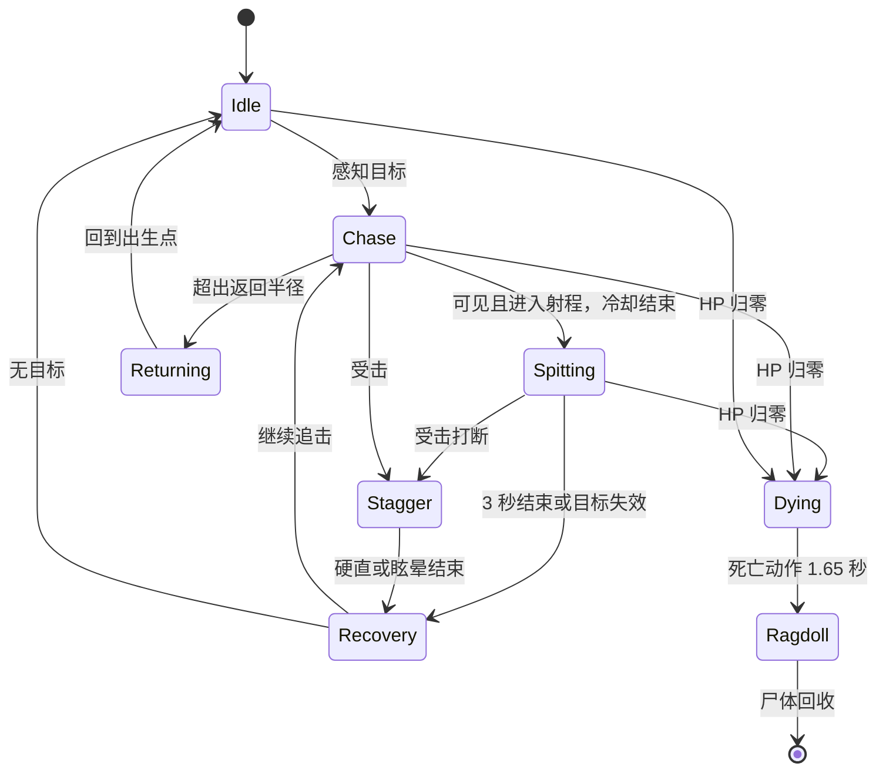

# 毒蛆：源动作、三维与行为合同

日期：2026-09-11。宿主 D:/FPS3D/FPSGAME。原参考来自项目 `assets/enemies/poison_maggot`，原始素材来自 `Y:/开发/游戏/素材库/怪物/毒蛆`。完整源配置及散列在 `SourceAssets/PoisonMaggot20260911/reference`。

## 已实际检查的动作

|动作|源帧/秒|循环|观察到的顺序|
|---|---|---|---|
|Idle|24 / 3|是|腹节缓慢呼吸、前身轻摆，短足保持支撑|
|Move|40 / 2.5|是|腹部从后向前压缩伸长，短足依次交错抬放；远侧脚遮挡，三维重建相位偏移|
|Spit|33 / 3|否|0-.7 秒收紧，.7-1.27 秒前身伸出/抬头；1.27-2.455 秒维持喷射，之后回落；尾腹保持接地|
|Death|27 / 1.8|否|头部下垂、躯干蜷曲、向侧面倒下，最后静止；不循环|
|Hit|新增 / .6|否|依据中性姿态设计局部缩颈受击，属于原创补充|

源 `startFrame=14, stopFrame=27` 为代码使用的 **零基、末端不含** 时间边界。窗口 `[14/33*3,27/33*3)` = `[1.272727,2.454545)` 秒。按固定 .05 秒网格发射 24 发，最后一发 2.422727 秒；不会因帧率下降漏发。原实现每帧最多发一发，UE 修正为按同一个技能时钟补齐逾期事件。伤害只由碰撞的毒球结算，动画/雾不重复伤害。

## UE 数值与行为

保留源等级 4、MaxHP 800（源当前 HP 680 是出生状态，UE 统一满血出生）、魔攻 24（int24/wis24 各 .5）、每发 round(24*.33)=8、防御前魔法伤害、中毒概率 .33、45 度扇形、8 秒起手冷却。距离改用 UE 600 cm、速度 500 cm/s；与二维像素数值相同但属于明确选定的 UE 调整值。移动 120 cm/s，模型目标体长 220 cm。经验 240、感知 1400 cm、返回半径 2400 cm、受击硬直 .45 秒/累计 80 伤害眩晕 1 秒为本次 UE 配置。

中毒沿用原玩家规则：每秒按当前层数扣血，不经过防御；每 5 秒减一层；新命中刷新 5 秒衰减但不重置下一跳，死亡/销毁清除。UE 本次增加 20 层上限。使用独立目标组件，避免改动并行开发的武器附魔毒规则。

模型约长 220 cm、宽 131 cm。移动胶囊按横向占地取半径 70 cm、半高 70 cm，专用导航代理宽 140 cm、高 140 cm、台阶 25 cm；完整模型的受弹与尸体碰撞由分节物理形状承担。

决策复用 BT_Monster / MonsterAIController：控制与死亡最高优先，返回、可见且冷却就绪则喷毒、追击/调查、待机。新角色仅执行状态时钟。喷毒开始锁定朝向，停止移动；目标死亡、丢失、受击打断或自身死亡取消剩余发射。已发射毒球在自身死亡时也清除；已命中毒效果独立自然结束。每颗球最多伤害一次，墙体阻挡，射程到期销毁。

图中死亡可从任何存活状态进入；Idle、Move 循环，Spit、Hit、Death 单次播放。实际位移驱动 Move 播放速度，喷毒由同一状态时钟采样动画和发射事件。

## 制作与来源

本地原角色图用于内置 imagegen 写实单角色参考；混元 hy-3d-3.1 只提交一次候选任务 `poison_maggot_v01`。不从动画里烘焙毒液到模型。保留白色软体身份、黑色口器/短足，隐藏侧和背面属于三维重建。模型、贴图和原始图片暂留本机，不公开发布未核准原始素材。参考生成提示词与任务 ID/参数保存在资产来源文件。

## 已完成的资产

高模焊接后 250,002 顶点，局部口腔调整保留同一连续表面。Quadriflow 四边面拓扑后 20,170 顶点、20,168 四边面；游戏导入时三角化。37 根语义骨骼，最多 4 个权重影响；腹节、头、下颚、口腔发射点和左右六对短足分开控制。所有权重和误差最大值为 4.47e-8。

可编辑源为 `SourceAssets/PoisonMaggot20260911/delivery/PoisonMaggot_Animated.blend`，内含完整动作和打包贴图；另存重拓扑 Blend、骨架 FBX、五个动作 FBX。正式 UE 资产在 `Content/Monsters/PoisonMaggot`，入口 `BP_PoisonMaggot`。精确文件散列见 [资产清单](PoisonMaggotAssets.json)。

4K BaseColor / Tangent Normal / Roughness 从高模重投影；UE 法线翻转绿色通道为 DirectX。UE 使用 Substrate 表面输出和 Default Lit PBR，保留黑褐口器与短足的真实反照率，细微凹凸和粗糙度控制湿润感。Blender 预览有少量组织散射；UE 材质以纹理与粗糙度为准。毒液使用单独绿色材质；喷声为本地合成短湿声，每三次发射触发一次，避免 20 Hz 音效堆叠。

重新导入各动作 FBX 后逐帧检查，Idle / Move 首尾最大顶点误差均为 0，五个动作最低点约 0.5 cm，时长分别为 3 / 2.5 / 3 / 1.8 / 0.6 秒。10 FPS 预览来自实际导出网格渲染，见 `SourceAssets/PoisonMaggot20260911/previews`。Death / Hit GIF 的循环与末帧停留仅用于预览，游戏动作不循环。

布娃娃使用按实际网格区域拟合的 9 个承重凸包，加一个不参与碰撞的根刚体，保持根坐标与物理坐标一致。主要腹节之间有角度约束，区域之间关闭自碰撞。死亡动画 1.65 秒交给物理，死亡后 20 秒回收；村庄默认在回收后 300 秒刷新一个新实例。多人复制未实现，本次验收范围为项目当前单机流程。

## 本次验证

完整独立场景行为验收 **34 项通过、0 失败**，结果保存在 `Saved/PoisonMaggot/arena-final/acceptance.json`，运行画面与日志同目录。已覆盖 PBR 纹理绑定、绕墙追击、前摇无伤害、固定 24 次发射、朝向锁定、命中/躲避/墙体、8 秒冷却、连续受击眩晕、弱击不缩短眩晕、毒每秒结算与自然到期、真实鼠标开枪命中、死亡取消在途/未发毒球、一次奖励、尸体接地及再次刷新。该次实测绕障最大侧向位移 436.99 cm，尸体最低点 -0.54 cm（接地允许误差 3 cm）。

共享行为树回归本次 16 项通过，护士实际枪击/攻击/死亡/重生回归 15 项通过，均无失败。对应日志分别为 `Saved/MonsterAI/play.log`、`Saved/MonsterAI/nurse-regression.log`，不得用它们替代毒蛆自己的验收。村庄实机场景 **6 项通过、0 失败**，完成保存点加载、可达导航、实际追击、喷射、死亡奖励、布娃娃接地；尸体地面间距最小 -0.19 cm。最终报告与画面在 `Saved/PoisonMaggot/village-final`。本次为工具驱动的真实游戏进程和画面检查，没有声称用户人工试玩或打包验收。

手脑村庄回归本次 30 项通过、0 失败，日志在 `Saved/PoisonMaggot/handbrain-regression.log`。全部验收项目、实际导出检查、日志和画面散列统一记录于 [验收清单](PoisonMaggotAcceptance.json)。

## 重建和运行

先构建当前 `FPSGAMEEditor Win64 Development` 原生模块，再使用 [重建入口](../Tools/PoisonMaggot/Rebuild-PoisonMaggot.ps1)。`-From Generated` 使用已经下载的 GLB 开始重拓扑，`-From Rig` 从现有拓扑制作动作，`-From Import` 导入交付 FBX/贴图，`-From Preview` 渲染导出复核，`-From Village` 保存村庄刷怪点。没有步骤会再次提交混元生成任务。

运行 [Run-PoisonMaggot.ps1](../Tools/PoisonMaggot/Run-PoisonMaggot.ps1)：默认打开独立场景，`-Village` 打开实际村庄，`-Audit` 使用隔离角色档案跑对应自动验收。当前点位标签 `PoisonMaggot_Village_01`，编辑器标记坐标约 `(-3302.08,32606.09,-11383.68)` cm，地面检测后实际角色根坐标约 `(-3302.08,32606.09,-11423.68)` cm；已检查坡度、占地、四点支撑、玩家距离并保存重载。

村庄自动验收等待专用导航就绪，在同一可达区域选择玩家落脚点，保留正式场景与刷怪点。验收进程临时使用 60% 屏幕比例和有限纹理/阴影池，以与其他正在打开的编辑器共存；未修改项目画质设置，不将结果作为 FPS 性能测试。预览相机会检测墙体遮挡，尸体取样直接查询死亡前实际站立的地面组件，避免世界射线误中相邻石墙。

工具注意事项：材质通过真实 RHI 编译并等待完成；命令行导图保留导航范围，但不保存尚未生成瓦片的空 Recast 实例，交给游戏加载时按配置生成。FBX 在 Blender 复核时解除自动推断的骨骼连接，以保留原先导出的位移轨道。尸体检测读取当帧物理混合矩阵，避免调用会重算动画的 `GetCPUSkinnedVertices`。项目的旧 `GetUsedTextures` 五参数函数在当前引擎为空实现，使用新版可选参数接口。

公开 Git 只包括源码、工具、说明和散列；完整 Blend、FBX、贴图、声音、UE Content 和源动作仍位于本机，恢复时保留相对目录。来源与使用记录见本机 `SourceAssets/PoisonMaggot20260911/provenance.json`。从新源码 checkout 运行还需恢复项目已有玩家、共享 BT 和 Normandy 场景资源，详见 [AssetSetup](AssetSetup.md)。
