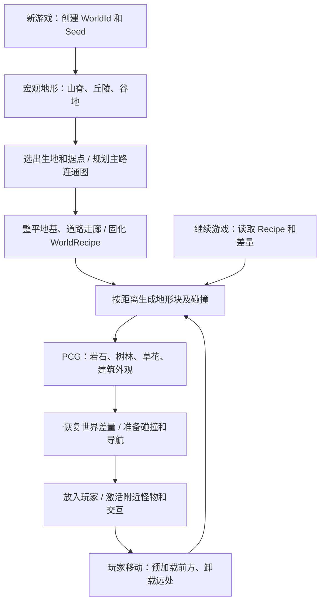

# PCG 随机丘陵大世界设计与本机资产评估

日期：2026-09-12。目标宿主：`D:/FPS3D/FPSGAME`，UE 5.8.2。
本文记录首轮系统设计和只读资产审计时的状态。后续已按用户追加要求开发独立的植被初版，并使用新加入的 Megaplants: Black Poplar，当前交付与边界见 [温带丘陵植被初版](temperate-hills-initial.md)。本文以下规模、半径和性能数值仍是完整世界的设计目标，不是实测结果；当前模块和资产接入状态以初版说明为准。

## 1. 结论和首期边界

建议首期做 **4.096 × 4.096 km 的温带丘陵世界**：草坡、疏林、岩坡、谷地、废弃村庄、战壕据点和小型工业设施。先在 1.024 × 1.024 km 验证区完成打包运行，再扩展至完整规模。每次点击“新游戏”产生新的地形、道路、据点和植被布局；“继续游戏”、死亡重生和退出重进使用原来的世界。

采用 **种子驱动的运行时高度场 + 分层 PCG 布景 + 独立世界状态存档**。地形生成、PCG 内容生成、流送和持久化分别有明确责任。

现有本机资源足以开始这个主题的样板和首期制作，但还不具备完整开放世界成品条件。草花、地表、废墟和军事道具充足；成熟乔木种类、连续大型悬崖、远景植被方案，以及能随机组合的据点模板需要补齐或制作。已有 PCG 示例并不是完整的新游戏世界生成器。

首期不要求洞穴挖掘、体素破坏、连续河流水文、沙漠/雪山生态、无限地图或多人联机。高度场可以表达丘陵和台地，不能表达一个 XY 下多层地面；小型洞穴入口可用独立网格据点处理。

## 2. 当前工程证据

| 核对项 | 本次发现 | 设计影响 |
|---|---|---|
| 工程插件 | PCG、PCGExternalDataInterop、PCGGeometryScriptInterop 已启用 | 不需要从零安装 PCG；不代表游戏模块已接入 |
| 游戏模块 | `Source/FPSGAME/FPSGAME.Build.cs` 没有 PCG、GeometryFramework 直接依赖 | 新世界运行逻辑需要增加明确模块依赖 |
| 入口地图 | `Config/DefaultEngine.ini` 指向 `/Game/GameMaps/DayNight_Lighting` | 新建独立世界宿主地图，不直接覆盖当前场景 |
| 现有 PCG | Normandy 2 图、MilitaryTrench 4 图；6 图均未启用分层生成 | 拷贝成项目专用图后改造；原图保留作为参考 |
| 地形输入 | Normandy 两图含 `PCGGetLandscapeSettings` | 不能将动态网格当作 Landscape 接入；需自定义表面数据/点输入 |
| 导航 | Recast 配置为 Dynamic，已有 Nurse/HandBrain/PoisonMaggot 三种代理尺寸 | 可复用代理合同，但还要接入局部导航生成与就绪屏障 |
| 玩家移动 | 可行走角度 45°，台阶高度 40 cm | 主路设计显著低于极限；崖面不可依赖角色自动爬越 |
| 存档 | `FColdSteelProfile` 有物品状态、Generation；掉落物含 Map、Position | 目前没有独立世界 ID、种子、地形与采集状态 |
| 掉落恢复 | `ColdSteelProfileRuntime.cpp` 按当前地图名恢复、判断拾取 | 同一宿主地图的不同随机世界必须加 WorldId 隔离 |

## 3. 生成顺序

宏观布局在新游戏加载阶段计算一次。进入游戏后只计算附近详细内容。PCG 清理渲染实例不等于清除世界状态。

`WorldRecipe` 在玩家进入前固定：布局不依赖玩家先走到哪一格、PCG 线程完成顺序或当前画质。宏观求解失败时按固定的 AttemptIndex 换子种子，最多 8 次；仍不成立则报告生成失败，不能偷偷生成不可达世界或重用用户旧存档。

## 4. 地形后端选择

| 路线 | 是否满足每局新丘陵 | 结论 |
|---|---|---|
| 固定 Landscape + 随机 PCG 散布 | 只改变地表物体，丘陵不变 | 不作为本需求的实现 |
| 烘焙地形模块按边界规则拼装 | 能随机组合，但形状受模块库约束 | 可用于以后制作美术控制较强的区域；目前没有完整无缝模块库 |
| C++ 运行时高度场、分块网格 + PCG | 可以改变山脊、坡度、谷地和据点位置 | 本方案首选；先做打包和视觉可行性验证 |

本机 `LandscapeProxy.h` 中 `Import` 位于 `WITH_EDITOR` 范围；不能把编辑器 Python 创建 Landscape 的流程当作打包游戏的生成逻辑。这里没有宣称引擎完全不能做任何运行时 Landscape 修改，而是当前工程没有可直接使用的完整生成后端。

首个后端使用 C++ 的 GeometryCore/GeometryFramework 构建 `UDynamicMeshComponent` 地形块，CPU 工作线程只生成数值和网格缓冲，游戏线程提交组件与碰撞。手动管理 LOD、边缘拼接和异步碰撞烹饪，不在 Blueprint 中每帧生成网格。

**必须先解决的视觉约束：** Epic 当前文档说明 DynamicMesh 不提供 Nanite、Mesh Distance Field、自动 LOD 和实例渲染，且其 Lumen 支持存在限制。不能承诺它有原生 Nanite Landscape 的表现。静态岩石、建筑和经验证的植被仍可使用其原生渲染方式。先用现有昼夜、雨天和建筑遮挡做真实打包画面验证；若地表间接光或远景质量不满足当前标准，应更换 `IWorldSurfaceProvider` 后端后再扩张世界，不把降级画面当完成。

`IWorldSurfaceProvider` 最小契约：`SampleHeight`、`SampleNormal`、`SampleBiomeWeights`、`SampleRoadDistance`、`GetChunkBounds`、`GetSurfaceRevision`。这些是本项目拟定义接口，不是现有 UE API。PCG 从相同高度函数获取表面，不能为每一棵草向物理世界发射射线，也不能由各图独立生成一份不同的地形噪声。

## 5. 丘陵、高差和可达性规则

高度由低频山脊与谷地、中频丘陵、低幅地表起伏叠加，再应用道路/地基修改印章：

`Hfinal = ApplyStamps(Hbase + RidgeField + HillField + DetailField, Roads, Foundations)`。

采用全球连续坐标采样及固定版本的噪声/哈希算法；块坐标仅划分输出范围，不重置噪声。参数预设通过固定种子样本测量和约束求解，不仅靠叠加噪声碰运气。

| 内容 | 首轮规则 | 游戏意义 |
|---|---|---|
| 全图高差 | 常规 0–250 m，局部高脊可至约 320 m；为相对基准 | 有可辨认的远景方向与制高点 |
| 丘陵 | 山包半径约 150–500 m，局部起伏约 20–80 m | 徒步途中有遮挡、暴露与视野变化 |
| 谷地 | 连续低地走廊，避免孤立深坑；保留可通行出口 | 为道路、遭遇和资源带提供结构 |
| 主路 | 纵坡目标 ≤15°，横坡 ≤8°，有效通行宽 ≥4 m | 玩家与三种现有导航代理均可通过 |
| 支路 | 纵坡目标 ≤25°；急弯适当放宽 | 可有绕行和较短的爬坡路线 |
| 据点地块 | 原地形平均坡 ≤8°；多点检查高差，整平后 ≤3° | 房屋保持竖直，不整栋顺坡倾倒 |
| 地基修改 | 默认最大挖填约 3 m，边缘 15–30 m 平滑过渡 | 避免巨型平台突然截断山坡 |
| 悬崖/岩坡 | >45° 不作为默认行走面；岩石装饰主要在陡坡 | 玩家能看懂不可达区 |
| 出生区 | 约 80–120 m 安全圈，稳定地面与完整净空，接入主路 | 不出生在树内、悬崖边或未加载碰撞上 |

先选据点候选，用低分辨率高度/坡度栅格求带坡度代价的路径；构建最小连通骨架，再增加 20–30% 回路，减少唯一死路。道路顺谷、绕坡或用发卡弯爬升。修路后重新检查纵横坡、切坡深度与全部必达据点连通性；不合格的边重新寻路或移动据点。

首期世界目标：1 个出生营地、约 6–10 个主要据点、20–35 个小型探索点。主要据点间距约 450–900 m，小点距常用路线约 100–250 m；由容量、可达性和地形共同约束。所有主要据点至少一条适配所需导航代理的可达路线。高地狙击位置应配侧路/遮挡；危险等级按出生地的路径距离和区域标签决定，避免纯同心圆。

## 6. 生态与美术规则

首期使用同一温带气候下的软边界生态权重：草甸、疏林、岩坡、湿润谷底、废墟覆盖。海拔、坡度、湿度场、道路距离和据点占地共同决定权重；海拔不单独决定全部生态。

| 层 | 放置条件 | 约束 |
|---|---|---|
| 主树 | 土层/湿度允许、坡度通常 ≤30°，聚簇分布 | 不完全贴合法线；树干主要竖直；限制相邻冠幅重叠 |
| 灌木 | 林缘、湿谷、废墟边缘，密度随大尺度噪声变化 | 不堵门窗、箱子交互面及主路 |
| 草花 | 坡度通常 ≤35°，草甸密、林下疏 | 排除道路中心、地基和巨石占地；花草按生态簇出现 |
| 岩石 | 岩坡、坡脚、侵蚀带和露头 | 按材质族成簇；小幅埋地，禁止用极端拉伸制造所有悬崖 |
| 地表 | 草土、泥土、碎石、岩面 4–5 主层 | 坡面三向投影、宏观色差抑制重复；统一尺度与湿润响应 |
| 建筑 | 已验证地块与门口朝向 | 使用 6–10 套经过游玩检查的据点模板，再随机模块、破损与道具 |

先放大体积物体，再生成小物；树/岩石/建筑共享 OccupancyMask。地块边缘需要邻格候选缓冲区，按稳定优先级决定拥挤冲突，最终仅由归属格生成；不能各格独立 SelfPruning 后留下跨格重叠。

现有 MW/GrassLandscape 的贴图与部分材质函数可复用，但 LandscapeLayerBlend、LandscapeGrassOutput、RVT 或 Landscape 坐标依赖必须逐项审查。动态网格采用自己的 `M_WorldGround`，输入高度/坡度/生态权重；不将 Landscape 主材质直接拖到地形网格后视为完成。

## 7. PCG 图的阶段合同

下列 `World*` 类是拟实现的项目节点/数据，其余名称为 UE PCG 类或内置节点。每条随机分支使用稳定子种子。先实现 CPU 确定性的权威点集；GPU 草花可作为后续纯视觉优化。

| 阶段 | 输入 | 核心节点/类（至少两个） | 关键参数 | 输出 | 调试方式 |
|---|---|---|---|---|---|
| 输入与分块 | WorldRecipe 参数、块边界、表面数据 | `UPCGDataFromActorSettings` + 项目 `UPCGWorldSurfaceSettings` + Grid Size | WorldId、Seed、Cell、Layer、Bounds | 表面/参数数据 | Debug 显示边界、版本与种子 |
| 主树/岩石候选 | Surface + BiomeWeights | `UPCGSurfaceSamplerSettings` + `UPCGAttributeFilteringSettings` | 密度、坡度、海拔、湿度、资产族 | 带稳定 CandidateKey 的点 | 候选数与拒绝原因计数 |
| 占地与空间约束 | 候选点 + 道路/地块 Mask | `UPCGDifferenceSettings` + `UPCGSelfPruningSettings` + 项目边界归属过滤 | 冠幅、门口净空、邻格缓冲、归属格 | 无跨格重复的主物体点 | 边界可视化与 ID 去重 |
| 变换与资产选择 | 合格点 | `UPCGTransformPointsSettings` + `UPCGMatchAndSetAttributesSettings` | 资产白名单权重、尺度、埋深、法线倾斜上限 | MeshKey/Transform/Bounds | 检查轴向、接地和重复率 |
| 据点组装 | 已批准地块、道路样条、模板 | `UPCGGetSplineSettings` + `UPCGCopyPointsSettings` + `UPCGStaticMeshSpawnerSettings` | 模板 ID、门口方向、地基高度、保留空间 | 模板静态外观与交互标记点 | 多点地基、入口与通路检查 |
| 草花覆盖 | Surface、剩余 Mask、主物体点 | `UPCGSurfaceSamplerSettings` + `UPCGDensityFilterSettings` + `UPCGDifferenceSettings` | 生态簇、密度、阴影/碰撞策略 | 草花点集 | 排除区域检查、透明过绘抽样 |
| 实例输出 | 点集、资产定义 | `UPCGStaticMeshSpawnerSettings` + 项目 `UWorldEntitySubsystem` | MeshKey、状态 ID、当前差量 | ISM/HISM 与受管理交互实体 | 实例/Actor 数、组件归属与差量一致性 |
| 就绪与清理 | 各层结果、地形版本 | `UPCGComponent` + `UPCGSubsystem` + `UPCGDebugSettings` | CollisionReady、NavReady、Epoch | ChunkReady / 卸载结果 | 状态机日志、回访同种子摘要 |

建筑语法不是首期必需：先把现有墙、门、屋顶做成可复用模板，确保人能进出。以后扩展立面时才加入 `UPCGSubdivideSplineSettings`/`UPCGSelectGrammarSettings`，使用 `GrammarSelection`，并维护可验证的模块尺寸字典。

显式设置 `GenerationTrigger = GenerateAtRuntime`、`bOverrideGenerationRadii`、每级半径及 `UPCGSchedulingPolicyDistanceAndDirection`。UE 5.8 局部更新用 `RefreshRuntimeGenExecutionSource`；只更新受影响块，不因天气或画质调整重抽世界布局。天气参数通常直接驱动材质，不触发重生成。

## 8. 分块、远景与帧预算

地形块 256 m；逻辑单元、PCG 网格和渲染 LOD 是不同概念，使用统一世界坐标换算。

| 层 | 建议网格 | 初始生成半径 | 卸载半径 | 策略 |
|---|---:|---:|---:|---|
| 地形近段 | 256 m | 约 512 m | 约 768 m | 2 m 顶点间距；碰撞与渲染独立 |
| 地形远段 | 256 m 或合并远块 | 1–4 km 分级 | 世界边界 | 4/8/16 m 间距；手动 LOD 和地标轮廓 |
| 建筑/大岩石 | PCG 256 m | 1200 m | 1560 m | 近段完整模板，远段轻量外观 |
| 树木 | PCG 128 m | 800 m | 1040 m | 实例化；更远用专门代理，不整片突然消失 |
| 灌木 | PCG 64 m | 250 m | 325 m | 逐级 LOD / 淡出 |
| 草花 | PCG 32 m | 90 m | 120 m | 关闭非必要碰撞，逐级减少密度 |
| 交互/怪物 | 世界实体网格 | 按武器可交互距离与约 200–300 m AI 活跃圈调参 | 有滞回 | 需要交互时激活；只为必要实体创建 Actor |

地形边界从同一高度函数采样；相邻 LOD 差不超过一级，用边缘三角形拼接消除裂缝。法线从全局高度邻域计算，不能在块边各算一次局部单侧法线。裙边仅可辅助遮盖，不能替代碰撞接缝正确性。

PCG 分层从大格向小格传数据，并在小格执行 Cull Points Outside Actor Bounds/归属规则，避免同一大格点在每个小格被再次输出。

World Partition 管理宿主关卡和预制静态内容；运行时新生地形块、PCG 生命周期与世界实体由 `UWorldChunkSubsystem` 管理。不能假设运行时 SpawnActor 会自动得到离线 World Partition Actor 描述与 HLOD。随机建筑与树林的远景代理需要专门生成/选择，不在新游戏中烘焙全图 HLOD。

首轮目标：在固定机器、分辨率和画质下，以 60 FPS（16.7 ms）作为基线，生成提交约 1–2 ms/帧，PCG 调度预算先设约 2 ms 再测。异步计算不等于无卡顿，碰撞提交、导航和资源首次加载仍需单独计时。预加载用运动方向与速度预测，转身后也保留近处安全圈；物理安全不能完全由视锥决定。

碰撞未就绪不能进入区块；传送必须等待目标区的碰撞/净空就绪。怪物在所需代理 NavReady 后才激活。射击范围内的大物体即使不模拟 AI 也要有可查询碰撞，不能沿用只为近距离拾取设定的小半径。

## 9. 种子、稳定身份与存档

建议 `WorldSeed` 使用显式保存的 64 位值；`WorldId` 是独立 GUID，即使用户输入同一个种子也能拥有两个独立存档。

`LayerSeed = StableHash(WorldSeed, GeneratorVersion, CellX, CellY, LayerId)`。

`EntityId = StableHash(WorldId, CellX, CellY, LayerId, CandidateKey)`。

CandidateKey 来源于原始采样格/候选键，不使用过滤后的数组索引、ISM 实例下标、Actor 名称或随机生成时序。算法版本固定哈希编码、坐标单位与噪声参数；权威布局采用可量化数据，Recipe 保存实际选中的宏观布局与修改印章。仅宣称同生成版本/同规则包的复现；跨引擎、跨平台兼容由固定样本摘要验证。

| 数据 | 保存内容 | 所有者/分类 |
|---|---|---|
| WorldHeader | WorldId、Seed、SchemaVersion、GeneratorVersion、RulesetHash、AssetCatalogVersion、Bounds | 世界存档；首期 Persistent-only |
| WorldRecipe | 生态参数、选中的 POI/道路、地基印章、宏观求解结果摘要 | 世界存档；Persistent-only |
| ChunkDelta | 砍伐/挖取、容器已取内容、门状态、建造物、世界掉落、怪物持久结果 | 世界存档；Persistent-only |
| PlayerWorldState | 所属 WorldId、位置朝向、安全落点、角色/背包存档引用 | 存档协调器；Persistent-only |
| 运行缓存 | ISM 索引、当前 Actor、PCG 调度任务、已加载网格/导航缓存 | 不持久化、不复制 |

首期单人本地权威，不增加 RPC。未来多人由服务器写 Recipe 与差量，Seed/Recipe/可见交互状态改为 Persistent + replicated，客户端只重建视觉，绝不各自决定掉落或资源奖励。

新游戏流程：选择新世界槽 → 创建 WorldId/Seed → 生成并验证 Recipe → 写初始世界状态 → 加载出生附近块 → 恢复玩家/背包归属 → 放入玩家。已有角色属性/仓库是继承还是重置，沿用以后确定的新游戏业务政策，生成器不擅自清空。

继续流程：读世界头和版本 → 读 Recipe → 构建目标块地形 → 恢复差量并过滤已移除实体 → 加载碰撞与导航 → 恢复掉落和交互 → 安全放入玩家。**先过滤已砍树，再输出实例**，避免回访时树短暂重生。

继续使用现有 A/B 世代与校验的思路，但增加一个世界/角色联合提交记录：记录同一 CommitId 下各槽的版本与校验，最后写入提交头。采集、开箱、掉落等跨背包与世界的操作先形成提案，成功持久化同一提交后才确认奖励；崩溃恢复只选完整提交，避免复制物品或采集状态回退。

旧档没有 WorldId 时仍属于原固定地图模式；明确迁移后才进入程序世界。生成版本或必需碰撞资产不兼容时保留旧档并提示迁移，不能用新规则静默重建成另一张地图。纯装饰资产缺失可替换同族备用，改变路线/地形的资产不能悄悄替换。

## 10. 类和模块责任

首期新增 `Source/FPSGAME/WorldGeneration/`，保留单一 FPSGAME 运行模块，避免提前拆大量模块。

| 拟新增类型 | 责任 | 最小公开接口 |
|---|---|---|
| `UWorldGenerationPreset` / `UWorldAssetSet` | DataAsset 规则和已审核资产白名单 | 只读参数、版本、软引用 |
| `UWorldSessionSubsystem` | GameInstance 生命周期，WorldId/Recipe/新开与继续 | CreateWorld、LoadWorld、GetWorldHeader |
| `FWorldLayoutGenerator` | 不依赖场景的数值求解 | GenerateRecipe、ValidateRecipe |
| `UWorldChunkSubsystem` | 区块排队、预加载、地形与 PCG 就绪、卸载 | RequestRegion、GetChunkState |
| `AWorldTerrainChunk` | 地形渲染、碰撞与 LOD | ApplyChunkBuffers、CollisionReady |
| `UPCGWorldSurfaceData/Settings` | 将唯一地形来源接入 PCG | Surface 采样、版本与边界 |
| `UWorldEntitySubsystem` | 稳定 ID、交互/资源/怪物激活、差量应用 | FindEntity、ActivateRegion、ProposeDelta |
| `UWorldPersistenceCoordinator` | 联合保存、恢复顺序、旧档迁移 | CommitWorldTransaction、RestoreWorld |

依赖方向：UI → Session；Session → Layout / Chunk / Persistence；Chunk → Terrain / PCG；Entity 与库存经事务接口协作。Preset/Recipe 为底层数据，不能反向引用 UI。头文件优先前置声明，PCG/几何具体类型留 `.cpp`，确需继承的头才直接包含。

拟追加私有依赖：`PCG`、`GeometryCore`、`GeometryFramework`；导航、AI、物理模块工程已存在。按实作 API 决定是否追加 `ProceduralMeshComponent` 或 GeometryScriptingCore，不同时装两套后端。编辑器审计/制作工具不能成为 Shipping 依赖，不迁移现有 UI/角色类路径。

## 11. 本机美术库审计结论

本轮扫描当前 FPSGAME、独立 FabNatureExport，以及 Epic 本机 VaultCache/FabLibrary 的目录与 manifest。范围是**本机已下载/有缓存记录的库**，未把网页公开商品当作用户拥有资产，也未登录核对账号全部云端收藏。

资产计数来自 UE Asset Registry，模型/材质属性做只读加载；没有打开/保存场景。完整明细在 `Saved/WorldGenerationAudit`，便携摘要见 [资产审计摘要](asset-audit-20260912.json)。计数含变体和辅助网格，不能当作独立物种或成品建筑数。

| 素材包 | 本次实际发现 | 当前状态 | 能满足的部分 / 缺口 |
|---|---|---|---|
| UnrealNormandy | 105 StaticMesh、23 FoliageType、2 PCGGraph；含三种枯树、草、灌木、岩石、墙门屋顶和废墟构件 | 已在 FPSGAME | 废弃石屋村、灌木草层、零散岩石；不能当作成熟森林树种库 |
| MilitaryTrench | 182 StaticMesh、4 PCGGraph、6 PCGDataAsset；沙袋、木桥、梯子、壕壁、土堆、焦树、石头和箱子 | 已在 FPSGAME | 战壕/据点美术充足；展示关卡不是自动无缝拼接的游戏据点模板 |
| SD_Art / Industrial Infrastructure | 152 StaticMesh；工业梁柱、梯子、栏杆、构架等 | 已在 FPSGAME | 小型工业 POI；需与村庄统一色调、密度与损坏程度 |
| Grass Landscape Material Vol. I | 28 Texture2D、21 MaterialFunction、3 Material、1 StaticMesh | 在 FabNatureExport，未导入 FPSGAME | 草地基础材质；需适配目标地形后端 |
| MW Landscape Auto Material | 16 StaticMesh、32 Texture2D、4 Material、6 PhysicalMaterial；草/土/岩/碎石/雪/沙地表，2 远山网格 | 在 FabNatureExport，未导入 FPSGAME | 首期地表和远景候选够用；远山不可当作可探索丘陵，自动 Landscape 材质不等于运行时地形生成 |
| temperate Vegetation / PN_FoliageCollection | 278 StaticMesh、278 FoliageType；96 花、110 草、72 地被变体；278 个网格均读到 4 LOD | 在 FabNatureExport，未导入 FPSGAME | 草花地被充足；这 278 个网格并不包含 278 种树 |
| Megaplants | 黑杨、Huckleberry Oak 灌木、Wood Anemone；58 StaticMesh 多为枝叶，49 SkeletalMesh，4 ProceduralVegetation | 在 FabNatureExport；本轮不加载全部高密度树体 | 是可用作者源候选；黑杨整树 A–D 是 SkeletalMesh，不是四种可直接送 Static Mesh Spawner 的树 |
| PWL / Weather / 水坑与 VFX | 天空灯光包、现有天气代码及本机天气内容；RPGEnvironmentVFX 含 22 NiagaraSystem | 已有项目内容；当前天气有并行改动 | 可以统一驱动户外环境；水坑不是河流/湖岸/桥梁生成系统 |
| Animal Variety Pack | 6 SkeletalMesh 和 146 AnimSequence | 已在 FPSGAME | 动物表现素材；尚不能当作已完成生态 AI 或随机刷怪规则 |

已实际查看本机地表色板和草花图集：草、土、灰岩、碎石适合温带废墟；主色与尺度仍需在同一晴天/阴天/雨天场景标定。图集来自既有导出，不是本次 UE 大世界渲染验收。

### 需要优先制作/补充的内容

1. **P0 森林主树种与运行配置：** 先筛选黑杨并做 1–2 个完整游戏树的渲染/碰撞/风动/远景样板，确认当前 UE 5.8 植被路径；另补约 2–3 个视觉不同的成熟树种。密林不能把每株高密度整树都当独立普通骨骼 Actor。
2. **P0 运行时地表材质：** 在草、土、岩、碎石中挑 4–5 层，重建适配高度场的材质、湿润与物理表面映射。
3. **P0 可拼装据点定义：** 从现有构件整理 6–10 套模板，记录 footprint、入口、路口、地基、净空、箱子/怪物标记点。需要制作规则和模板，不是优先买更多房屋。
4. **P1 悬崖/坡脚：** 当前有小岩石、土壁、露头候选，但未发现已经验收的连续大型悬崖套件；补约 4–6 种轮廓和坡脚衔接，若首期只做平缓丘陵可稍后处理。
5. **P1 远景：** 地形 LOD、森林代理、据点低成本外观都要制作并验证；不能把 Nanite 标志当作全图自动流送方案。
6. **后续主题：** 若加入河湖、雪山/沙漠或矿洞，另补河岸与流水、桥头适配、对应树种和岩体；现有一张雪/沙贴图不足以形成完整生态区。

来源/许可按原包保留。本地文件和缓存不自动证明原始素材再分发许可；本次没有采购、下载或公开上传二进制。Grass/PN 的本地 README 保存了 2026-09-09 入库与 Standard License 记录，此历史记录不替代以后发售前的来源清单。

## 12. 实施与验收顺序

| 阶段 | 交付 | 进入下一阶段的条件 |
|---|---|---|
| A：运行时地形验证 | 独立 1 km 测试地图；相同种子复现、不同种子改丘陵；接 PCG 石草 | 打包游戏可运行；边界/碰撞/光照满足要求。优先验证 DynamicMesh 的视觉限制 |
| B：美术样板 | 一段草坡、一处林缘、一片岩坡、一个废村；已审核的资产白名单 | 同机位晴/阴/雨与近中远对比，材质、风动、接地、LOD 和成本通过 |
| C：规则闭环 | 出生、道路、POI、局部导航与怪物；1 km 完整可玩区 | 必达点连通，门口净空，坡面不穿地，三种代理按实际用途测试 |
| D：存档闭环 | 新开/继续、砍伐/容器/掉落、回访、跨世界隔离 | 同种子同版本摘要相同；A 世界的物品不会出现在 B 世界；崩溃恢复不复制奖励 |
| E：4 km 世界 | 分层流送、远景代理、快速移动与传送 | 固定画质/硬件长距离运行，无缺地碰撞；记录帧耗时、峰值内存和生成等待 |

纯算法阶段用 100 个固定种子验证世界 bounds、地形接缝、路线连通、出生点与候选 ID 唯一性。真实性能只在真实渲染打包游戏测；不把 NullRHI、编辑器预览或单一截图当作大世界验收。

必须测试改变线程调度和加载顺序后的布局摘要、同格卸载/重进、存档版本不匹配、世界切换、清理中尚未完成的异步任务。每个区块任务携带 WorldId + Epoch，旧世界结果不能回写到新世界。

## 13. 本次验证边界与参考

本次完成：本机资产目录/缓存核对、UE 资产注册表与模型/PCG 元数据审计、引擎头文件/官方文档核对、既有图集查看、设计文档。

本次未执行：生成实际随机世界、资产迁移、NavMesh 大世界压力测试、PIE/打包世界运行、FPS 承诺、账户全部云端资产清点。

审计工具：[audit_world_assets.py](../../Tools/WorldGeneration/audit_world_assets.py)。输出目录：`D:/FPS3D/FPSGAME/Saved/WorldGenerationAudit`。主工程 commandlet 可能因已存在的 GameFeatureData 配置错误退出为 1，审计完成标记与逐资源错误单独报告；不能写成全工程验证通过。

官方依据：

- [PCG 分层与运行时生成](https://dev.epicgames.com/documentation/en-us/unreal-engine/using-pcg-generation-modes-in-unreal-engine)：生成源、分层网格、半径、清理、调度与跨格重复点。
- [PCG 与 World Partition](https://dev.epicgames.com/documentation/en-us/unreal-engine/using-pcg-with-world-partition-in-unreal-engine)：Data Layer/HLOD 配合，不等于自动生成全新随机世界。
- [Geometry Scripting / DynamicMesh 能力边界](https://dev.epicgames.com/documentation/en-us/unreal-engine/geometry-scripting-users-guide-in-unreal-engine)：运行时网格支持与 Nanite/LOD/距离场限制。
- [Normandy 作者商品说明](https://www.fab.com/listings/bf734560-f98b-4e4d-9a6c-e473b910a780)：模块化废墟和 PCG 植被定位；本次具体数量以实际导入注册表为准。

本机进一步定位：`Source/FPSGAME/UI/ColdSteelProfileRuntime.cpp`、`ColdSteelInventoryTypes.h`、`FPSGAMECharacter.cpp`、`Config/DefaultEngine.ini`；引擎 `Landscape/Classes/LandscapeProxy.h` 与 `PCG/Public/PCGComponent.h`、`PCG/Public/Subsystems/PCGSubsystem.h`。
