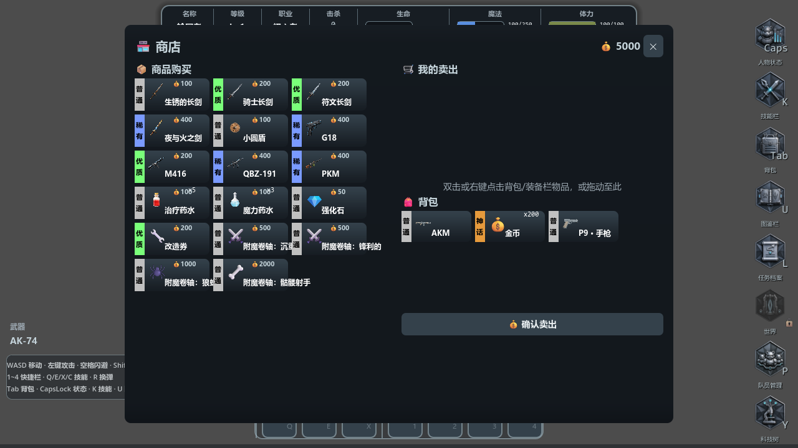
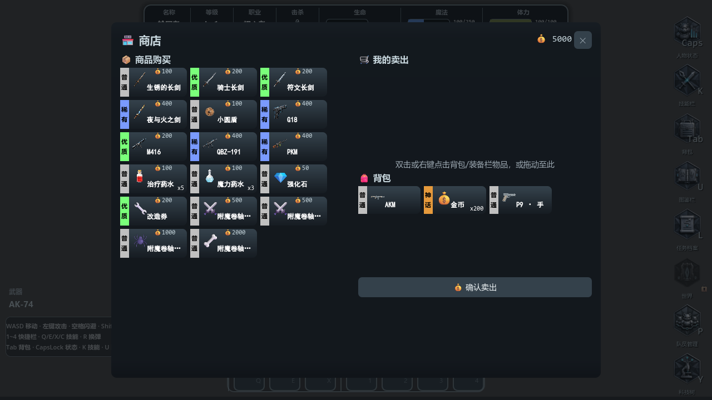
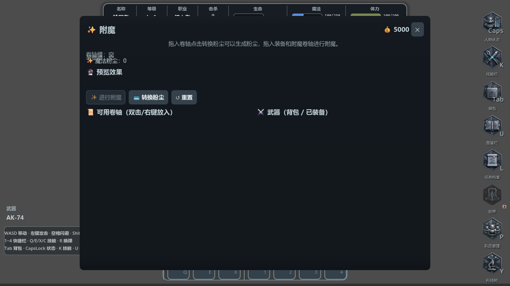
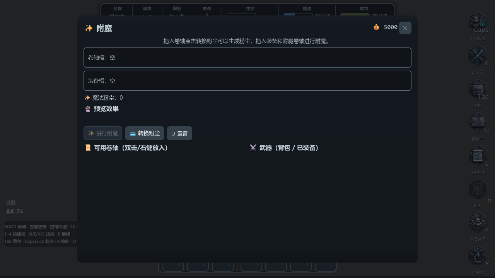
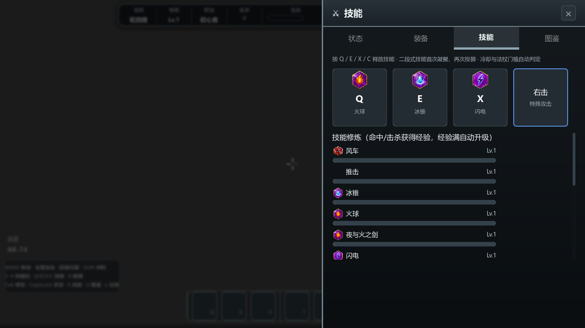

# 冷钢 UI 审计与改进 · 2026-09-06

基准：[完整源规则](reference/game-dev-cold-steel/README.md)。证据：本轮原生 Godot D3D12 渲染，1280×720，独立 UI 宿主，未通过游戏战斗流程抵达页面。源快照保持不变；SimHei 物品名例外保留。

## 审计步骤与覆盖

1. 读取基准 CSS、字体档位、语义色、关闭按钮和焦点规则，对照运行中的主题配置与控件。
2. 渲染状态、装备、技能、图鉴四页，随后逐个打开商店、强化、改造、附魔、任务、合成、出征、仓库。
3. 检查截图中的裁切、遮挡、字体和配色，修正共享组件后重走这12页。
4. 验证物品操作回归、组件行为以及面板关闭后浮窗隐藏。

## 发现与处理

| 问题 | 证据/影响 | 本轮改进 |
|---|---|---|
| 技能卡仍用棕色 #3D342B/#6B5D4F | 技能页偏离冷灰主题 | palette 改为 #232b33 / 冷灰边线；技能语义图标保留 |
| 商店长物品名越界 | 名称侵入相邻商品，价格和堆叠重合 | 限定名称宽度并省略，名称SimHei12；堆叠移到右下、价格留右上并用Consolas11 |
| 空物品槽高亮白边 | 仓库空格错误抢占视觉注意力 | 空格统一主题边框，不使用普通物品稀有度白边 |
| 附魔拖放槽高度为0 | 两行槽名与粉尘说明叠在一起 | 共享拖放槽最小52px、冷灰边线；附魔文字内边距和垂直居中 |
| 改造右侧物品被横向裁切 | 两个窄栏各塞两列170px格 | 改为每栏单列，保留全部物品及既有业务操作 |
| 公共面板缺少字体继承/背景层次 | 默认控件字形和背景HUD干扰阅读 | 公共面板挂统一Theme，增加冷钢暗化遮罩 |
| 普通关闭动作使用红色 | 红色误表达危险操作 | 浮窗关闭色改中性；公共关闭按钮32px |
| 通用按钮缺失默认主题焦点，面板按钮禁用焦点 | 键盘无法辨认/访问操作 | Theme补焦点边框；公共按钮与关闭按钮开启FOCUS_ALL |
| 纯数字使用UI字体，属性正文13px | 状态数值、仓库页码不符数字字体规则 | 状态数值/等级、金币和页码Consolas；属性正文14px |
| 关闭面板后可能留下固定浮窗 | 浮窗跨面板残留 | 关闭时取消固定并隐藏；隐藏面板不再响应悬停展示 |
| 旧测试按同名ID验证卖出 | 初始一把+购买一把，卖出一把后误报 | 改为按instance_id核对移出与出售暂存，保留独立装备语义 |

## 对比证据

### 商店：名称、价格与数量

修改前：

修改后：

### 附魔：重叠槽位恢复

修改前：

修改后：

### 技能：移除旧棕色

## 验证与边界

- 12页修改前后截图见 `docs/preview/ui-audit/`；渲染脚本 `tests/render_ui_audit.gd`，包含关闭浮窗断言。
- 背包36项检查通过；NPC面板28项检查通过；战斗与换弹检查通过（战斗测试的HUD准星项因status_bar_missing跳过）。
- 通用组件14项行为检查通过，但该独立测试退出时仍报告4个ObjectDB实例、2个资源未释放，未作为无告警通过。
- 完整主场景180帧无头运行出现 `material_get_instance_shader_parameters: material is null` 与退出资源告警；不能宣称完整场景运行无错误。本轮UI专用GPU渲染无上述错误。未改并行开发中的模型/材质代码。
- 导入时Terrain3D DLL复制/加载失败，UI脚本仍可独立运行；不把该导入日志算作整项目导入成功。
- 尚未完成：图鉴业务仍为占位页；世界/队员/科技树未接入的玩法不在本轮UI改进中伪造。主菜单、全部设置页、每个浮窗展开态、全键盘操作链以及其他分辨率没有在本轮逐项视觉验收。
- 用户原背包白色装备布局、原始八张右栏图标及SimHei字号/加粗校准保留。原CSS全部规则已归档，不代表本轮已逐一转换所有选择器。
