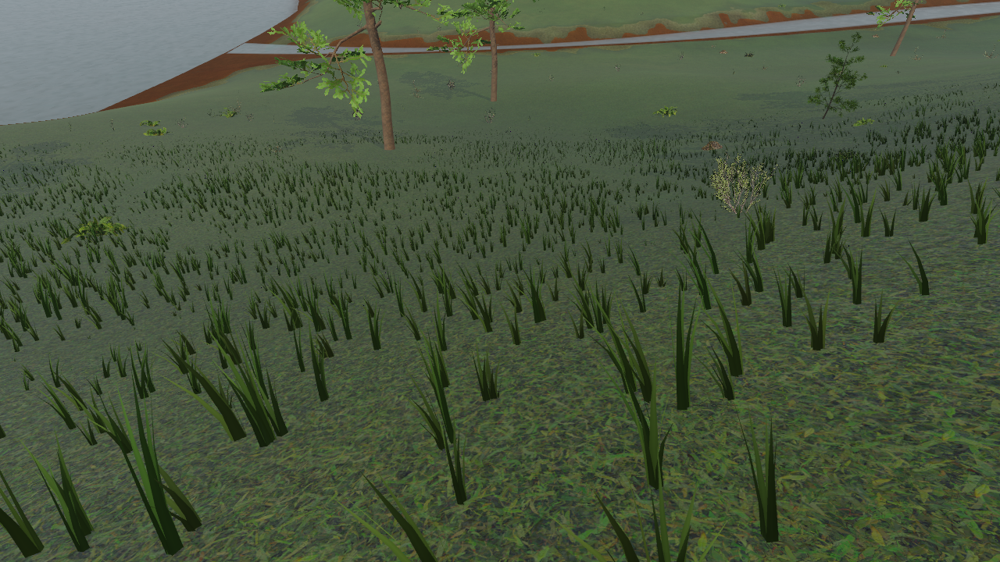
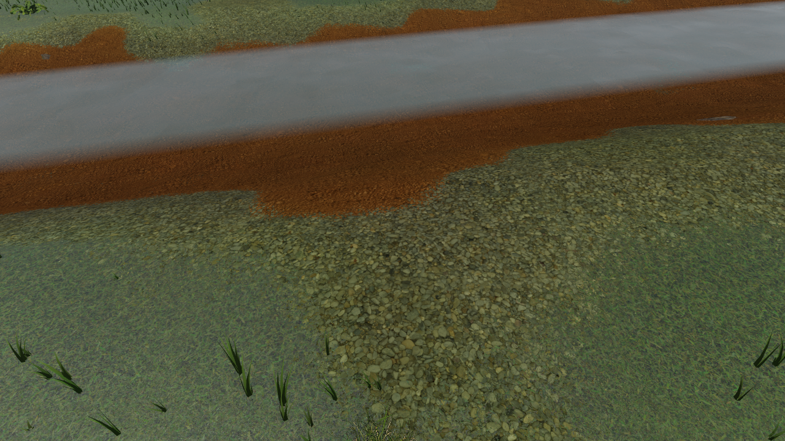
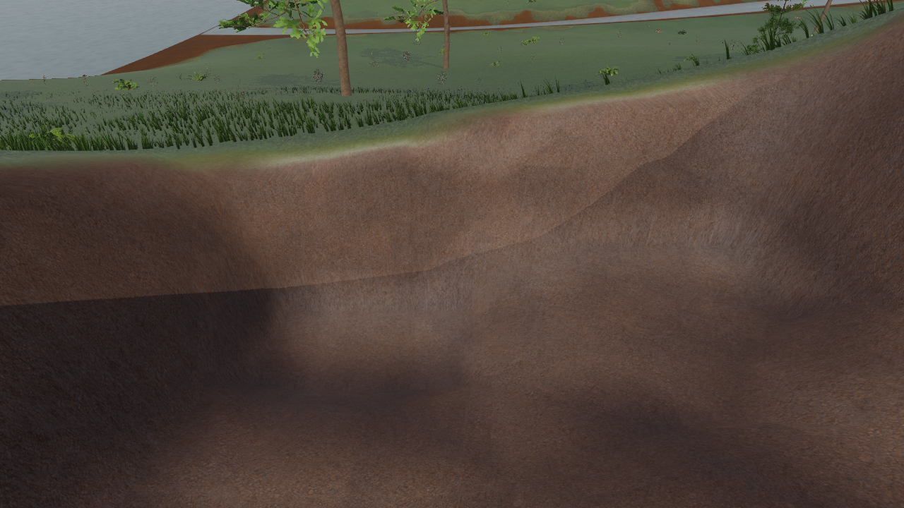

# 可编辑旷野与材质优化 · 2026-09-06

正式旷野按 F7 切换地形编辑；左键挖掘、右键填充、1–4 选材、Ctrl+Z 撤销。主场景新增绿色试验场入口，试验场蓝色入口进入局部旷野接缝样板。材料和存档独立于正式背包。

未编辑地面保持 Terrain3D，编辑附近按需生成平滑曲面；挖开草皮露出泥土，回填保留裸土痕迹。草木遮罩和支撑碰撞随地形更新。已编辑区域尚不卸载，没有流体和建筑承重模拟。

默认保留下载草地、碎石和岩石，河岸与挖掘面使用生成泥土的同源近似材质组。修正尺度、粗糙度、近远细节和重复纹理。细化草叶同时保留每簇 30 个近景三角形和中远档小网格；河床粗沙纹更换为泥沙，水波改为不规则变化。生成来源与提示词在 `assets/textures/wilderness_generated/README.md`，Terrain3D 衍生 shader 保留插件 MIT 来源，原插件许可证仍在 addons/terrain_3d。

此提交从远端 main 独立整理，不包含共享工作区其他会话的采集工具、昼夜系统、枪械或 UI 修改。公共光照使用本任务的静态 HDRI 设置；下面截图是在发布工作区重新渲染，避免将共享工作区的其他效果当作发布内容。

验证：无头导入和 180 帧主场景、战斗、换弹、方块材料与存档、平滑法线、旷野世界、场景和传送门检查。真实旷野 2,809 条坡地射线 gaps=0，挖掘与保存断言通过，发布版六张固定机位截图已生成。日志中的 Terrain3D 兼容接口弃用警告及部分退出资源提示另行保留，不宣称零警告。截图期间使用独立背包和地形存档。

复现截图：运行 `tests/review_wilderness_materials.gd`；`WILDERNESS_MATERIAL_VARIANT` 选择配置，`WILDERNESS_REVIEW_LABEL` 区分批次，`WILDERNESS_REVIEW_OUTPUT` 指定输出目录，默认写 user://material-review。原始、调校旧材质和生成材质的对照模式保留，相关图像不是无引用废案。

补充验收边界：战斗脚本退出码为 0，但自身打印 `proj_hit_damage=false`，且缺少状态条时跳过准星隐藏检查，本次不将这两项列为通过。换弹结果 `ok=true`，本轮未改动战斗或枪械代码。主场景 180 帧复测使用独立背包存档，未再加载其他开发线的本地物品；没有脚本错误，退出资源提示保留。玩家落地和填土避让按实际胶囊碰撞体计算，兼容不同玩家原点约定。

清理仅删除任务输出目录的六张隐藏水面诊断截图；保留原始生成图、有效对照、处理脚本、六张发布预览。经验入口：`skills/godot-terrain-vegetation/SKILL.md` 与 `references/editable-wilderness.md`。
