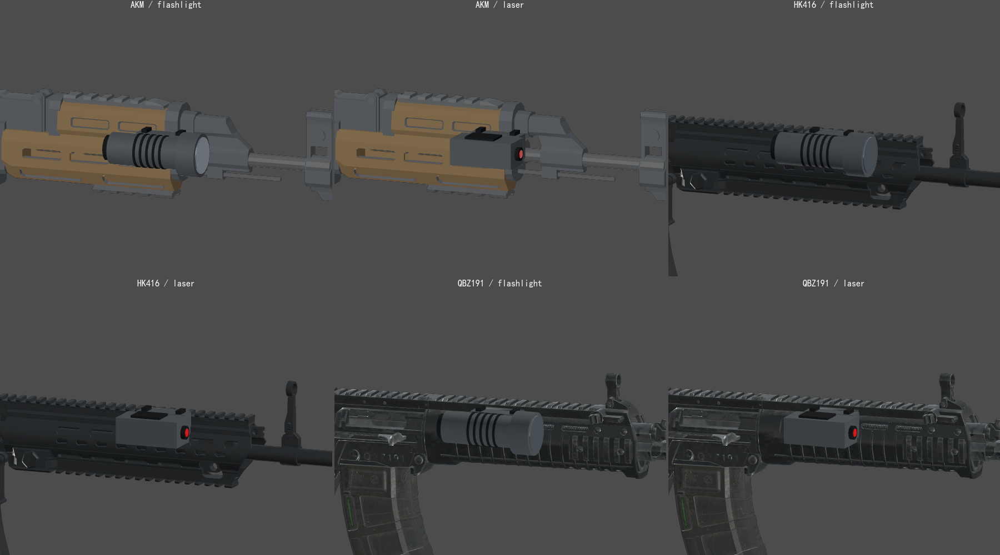

# 改造件无间隙装配与战术挂件案例

2026-09-06 用户明确要求：改造件组装不要有间隙。本合同适用于所有枪械配件，不仅是本次手电与激光。

## 装配验收

- 应接触的组件必须实际贴合：枪身→夹座→连接架→外壳，以及镜片、尾盖、螺钉等内部连接都要检查。不得交付可见悬空、断开的连接、重复模型或非设计性的穿插。设计上的通风孔、光学通道、镂空结构保留，不能用填满孔洞掩盖装配问题。
- 每把适配枪都测量实际源网格或已烘焙蒙皮表面，不能根据包围盒、贴图轮廓、其他枪的偏移值或单张侧视图猜测。曲面护木与平面夹座之间使用对应枪型的贴合底座；通用主体继续复用，适配器负责挂点与底座形状。
- 在底座边缘、转角及实体承力区域检查表面距离，并从正面、侧面、斜上方和背面渲染复核。数值采样只证明采样位置；不能把若干点通过描述为整个连接面绝对无缝。数值容差不是允许肉眼可见间隙的理由。
- 控制必要的内部接合量，不靠把主体埋进枪身消除空隙。曲面底座不能侵入握持区、遮住活动件或穿到枪身另一侧。
- 装卸、同槽变体互换和重新打开后，只保留一套当前组件。换弹、装备、射击和ADS时检查骨骼跟随与接触，不靠静止姿态通过验收。
- 材质在游戏与改造预览中走同一表面处理；外壳、底座使用现有枪械涂层/纹理，橡胶、镜片、反射面保持物理材质区别。统一材质不等于把所有部位变成同一种金属，也不能用改光源遮掩模型问题。
- 修改几何时先生成独立候选并验证，再更新正式资源；保留可编辑源和生成器。完成后提供真实装配近景、检查结果和未覆盖范围。

## 战术挂件的实际问题与修正

旧手电/激光复用了估算侧向偏移，实际护木表面测量发现约7–19mm间隙；外壳虽然使用PBR参数，却没有接入现有统一涂层。仅凭远景预览宣布“贴合、材质统一”不足以验收。

修正时分别测量AKM、HK416、QBZ191的烘焙枪身三角面，向内收紧挂点，补充贴合曲面的底座。AKM底座跨过原有通风孔，不填孔。侧向螺钉改正安装方向，激光镜片与发射口之间的小间隙也同步修正。

本案例实体采样点检查底座正向间隙不超过0.1mm、内部接合不超过1mm，并配合装配渲染；这只是本案例的数值检查精度，不是今后所有模型可以留缝或嵌入1mm的许可。通风孔和未采样区域不在数值保证中。

本地实现入口（复用前先确认存在）：

| 责任 | 本地路径 |
|---|---|
| 共享几何与可编辑场景生成 | `tools/build_tactical_attachments.gd` |
| 每枪挂点、贴合底座、统一表面处理 | `scripts/tactical_variants.gd` |
| 手电、激光光点与直线光束 | `scripts/tactical_device.gd` |
| 实际枪身表面接触采样与多角度渲染 | `tests/probe_tactical_fit.gd` |
| 安装、变体互换、保存、卸下和单一组件检查 | `tests/test_tactical_attachments.gd` |

## 当前射击与挂件合同

- 腰射随机散布和后坐力分开：腰射在屏幕准星限定的圆盘内均匀采样，半径使用平方根采样避免集中于圆心；HUD边界和弹道使用同一半径。后坐力仍改变后续射击方向。
- ADS不加随机散布，开枪前先采样当前可见瞄准点，再触发本发动画/后坐力。不要把腰射随机逻辑扩展到ADS。
- 激光减少100%腰射随机散布并缩小准星，保留后坐力；开镜耗时增加200ms。时间增减与其他配件叠加，进入和退出ADS分开处理。该“慢200ms”来自本次已说明的约定，不能直接推断其他含糊数值的符号。
- 战术手电与激光占同一个槽位，三款步枪支持、P9排除。草稿→预览→应用→武器实例保存；字符串型号ID显式规范化，不以`bool(string)`解析。
- 手电持枪时照明，收起/卸下时停止；光源接受几何遮挡。激光从发射器延伸到目标，射线遇到障碍时截断，收起后光点和光束一并隐藏；保留深度检测，不能穿墙显示。
- 增益绿色、减益红色、中性功能说明使用正文色。激光的散布减少是增益，开镜耗时增加是减益；手电照明为中性功能。沿用[改造页面格式](gunsmith-ui.md)。

## 清理和发布边界

本次保留模型源、生成器、最终装配图、多分辨率验收图及必要失败记录；清除被新分辨率截图替代、无代码/文档引用的6张旧战术挂件面板预览。旧套筒仍是枪托/握把生成器的坐标来源，不能因不直接渲染就当废案删除。

本卷及证据图可独立发布，不代表表中本地运行代码和依赖已进入远端。共享分支混有其他任务时，按WORKFLOW第8节从远端基线隔离发布，只暂存明确范围，检查完整暂存差异与资源大小，普通推送后回读远端SHA。不要将缺失依赖的枪械功能当作已完成的运行发布。
