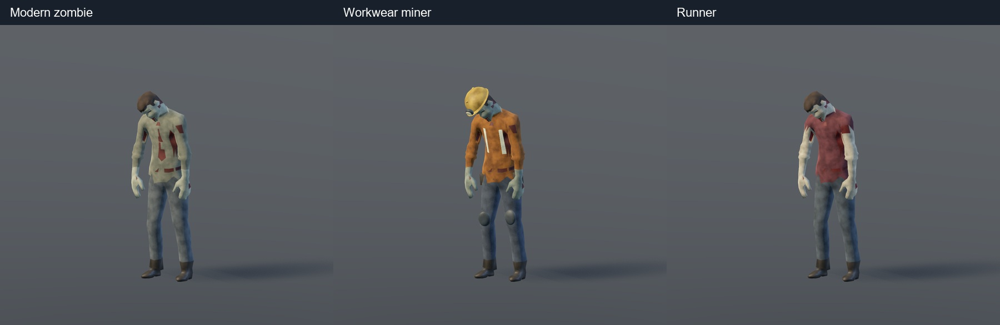

# 人形僵尸延展 V01 · 2026-09-06

基于已接入的现代普通僵尸，完成两个独立变体及主场景接入。继续使用 Denys Almaral 的现成动画与 Quaternius UAL 的倒地，不新增程序拼出的攻击姿态。角色动作参考见 [reference-notes.md](reference-notes.md)。

| 项目 | 工装矿工 | 狂奔僵尸 |
| --- | --- | --- |
| 场景 | `scenes/enemies/miner_workwear_zombie.tscn` | `scenes/enemies/runner_zombie.tscn` |
| 外观 | 黄安全帽、头灯、橙色工装、贴身反光条、腰包、护膝 | 暗红破袖上衣、暴露手臂、皮肤表面伤口 |
| 移动 | 原生 slowWalk_85f，2.833 秒 | 原生 running_58f，1.933 秒 |
| 移动标定参考速度 | 0.197768 m/s | 2.357897 m/s |
| 游戏追击速度 | 0.35 m/s | 2.8 m/s |
| 生命 / 防御 / 伤害 | 160 / 40 / 16 | 90 / 15 / 11 |
| 攻击起手间隔 | 2.3 秒 | 1.8 秒 |
| 骨骼 / 三角形 | 31 / 4712 | 31 / 1724 |
| 可编辑源 | [矿工 Blender](miner/miner-zombie-v01.blend) | [狂奔 Blender](runner/runner-zombie-v01.blend) |

这些是本轮变体的初始玩法数值，不是原二维矿工数值的迁移。两者都使用左右交替徒手挥击，时长 1.567 秒、有效窗口 [0.60,0.77)；2.4 秒倒地后保尸 1 秒。`Walk` 是控制器的通用移动动画名，狂奔资产中的该条目实际包含原生跑步。

## 已接入范围

主场景 `_build_enemies()` 中新增两只正式实例：矿工 (-8,0,-7)、狂奔 (7,0,-10)，连接现有玩家、伤害、Buff、击杀与头部弱点接口。重启主场景后进入它们的警戒范围即可遭遇。普通僵尸原来的替换保持有效。

新场景独立可供后续刷怪使用；本轮没有修改副本奖励表、存档怪物 ID 或原二维矿工的专属攻击规则，也没有将新工装变体冒充原矿工完成迁移。工头与喷吐僵尸保持各自身份。

## 材质与制作

两套均重烘焙为单个 2K PBR 材质。矿工新增部件在绑定姿态下建模、分配相应骨骼权重，反光条投射贴合躯干并转移附近皮肤权重，合并网格后统一 UV 与烘焙。狂奔的伤口直接使用原表面区域，避免附加球体浮在皮肤上。受击闪红材质按实例独立，多个同类不会一起闪红。

`build_variants.py -- miner|runner` 由 Blender 执行，读取本目录冻结的 `base_pipeline.py` 和 `geometry_hook.py`。原始 glTF、BIN、动画及公开来源记录继续保存在相邻 `modern-zombie-v01-20260906/`。每个变体保留最终执行脚本、Blender、GLB、纹理和构建报告。运行 GLB 位于 `assets/models/humanoid_variants/`。

许可证见 [LICENSE](../../../assets/models/humanoid_variants/LICENSE.md)：Denys Almaral 模型与原生动作 CC BY 4.0，UAL 补充动作 CC0。发行时保留作者署名。

## 验证

- 导出 GLB 重新导入 Blender，矿工采样 968、狂奔采样 914 个动画姿态；检查 UV、最多四骨影响、权重归一化和有限坐标。报告分别位于 `miner/asset-validation.json`、`runner/asset-validation.json`。极端中间姿态最深地面交叠约 2.1cm（矿工倒地），最终躺倒接地。
- `tests/test_humanoid_variants.gd`：真实物理移动、落地、动画循环、三姿态头部射线、独立受击材质、前摇无伤害、低帧命中去重、左右交替、冻结中断、侧移躲避、死亡与尸体回收。
- 原普通僵尸行为与动作回归通过。战斗与换弹脚本业务结果通过，但旧测试夹具仍输出 WarehousePanel 绑定错误；编辑器无头退出有资源/RID 清理提示。未将这些日志计为全无错误。
- 主场景默认 D3D12 Forward+ 实际渲染验证正式模型引用和玩家绑定，`runtime-final.log` 无脚本或引擎错误。截图期间仅隐藏其他角色以避免遮挡，不修改游戏中的可见性。
- 完整动作 GIF 由实际 GLB 在 Godot 中逐帧渲染，10 个 GIF 的帧数和时长已核对，见 `previews/validation.json`。截图与自动化运行没有替代玩家完整战斗试玩。

[矿工慢走](previews/miner-Walk.gif) · [矿工攻击](previews/miner-Attack.gif) · [矿工倒地](previews/miner-Death.gif)

[狂奔跑步](previews/runner-Walk.gif) · [狂奔攻击](previews/runner-Attack.gif) · [狂奔倒地](previews/runner-Death.gif)

## 本轮建立的复用方式

同一骨架和已验证的攻击/死亡时序用于不同衣装与步态。后续增加变体时先选原生移动、攻击参考，再做绑定姿态下的附件和材质；大改体型或持械时，单独重定向、修正握持及接触，不把徒手挥击直接当作持镐攻击。现有工程入口已足够复用，不另建一套动画状态机。

## 2026-09-06 整理记录

已清理数字命名逐帧截图与 Blender 自动备份；最终 GIF、动作检查表、命名近景、源文件、许可与重建输入保留。再次打包预览前先按重建步骤重新渲染。制作目录已用 `.gdignore` 排除游戏导入。
